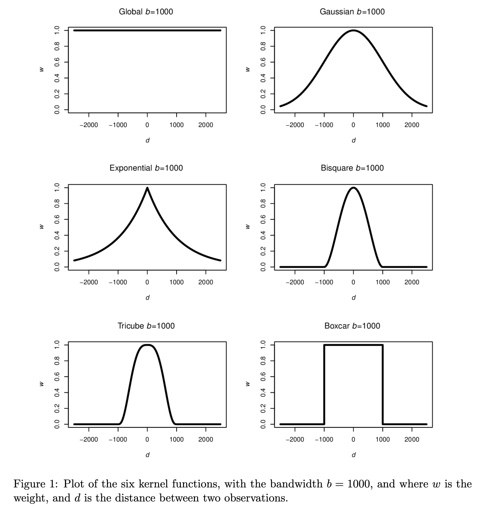
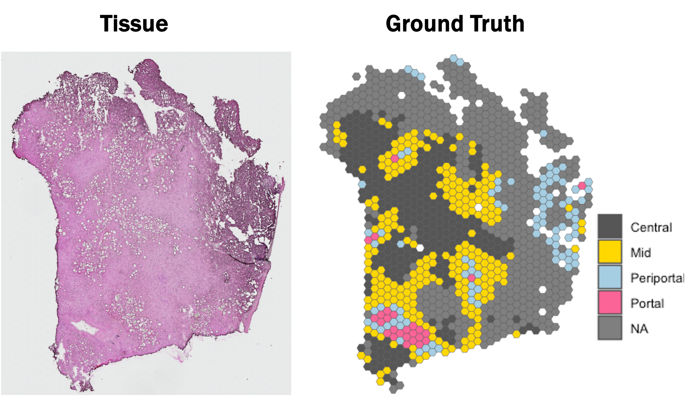
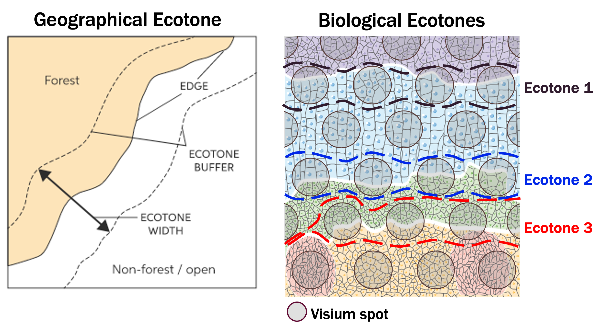

```{r, include = FALSE}
knitr::opts_chunk$set(
  collapse = TRUE,
  comment = "#>", 
  eval = TRUE
)
```

# Introduction

Welcome to the vignette of STExplorer. STExplorer is a package the performs geographically inspired analysis of spatial transcriptomics data.

## Install/Load package

```{r }
## To install the stable version of the package from Bioconductor run the below:
# if (!require("BiocManager", quietly = TRUE))
#     install.packages("BiocManager")
# 
# BiocManager::install("STExplorer")


## To install the development version of the package form GitHub run the below:
# if (!require("devtools", quietly = TRUE))
#     install.packages("devtools")
# 
# devtools::install_github("LefterisZ/STExplorer",
#                          force = TRUE)

```

```{r setup, echo=FALSE, eval=FALSE, message=FALSE}
## To load the package use:
library(STExplorer)
## Additional packages for the vignette:
library(readr)
library(RColorBrewer)
# library(SpatialFeatureExperiment)
# library(tidyverse)
# library(scran)
# library(scater)
# library(ggspavis)
# library(sf)
# library(spdep)
# library(GWmodel)
# library(tidyterra)
# library(ggplot2)
# library(igraph)
# library(pheatmap)
# library(ggExtra)
# library(future)
# library(doFuture)
# library(foreach)
# library(progressr)
# library(parallel)
# library(cols4all)
# library(pheatmap)
```

The STExplorer package utilises methods from Geography's spatial data analysis techniques and packages to perform a spatially-aware and spatially-weighted analysis of spatial transcriptomics data. Below is a series of packages from the field of Geography that STExplorer depends on in one way or another.

-   [`spdep`](https://cran.r-project.org/web/packages/spdep/index.html) is a collection of functions to create spatial weights matrix objects from polygon *contiguities*, from point patterns by distance and tessellations. It is used for summarizing these objects, and for permitting their use in spatial data analysis like regional aggregation and tests for spatial *autocorrelation*.

-   [`sf`](https://cran.r-project.org/web/packages/sf/index.html) (*Simple Features for R*) is a package that offers support for simple features, a standardized way to encode spatial vector data.

-   [`GWmodel`](https://cran.r-project.org/web/packages/GWmodel/index.html) is a suite of models that fit situations when data are not described well by some global model, but where there are spatial regions where a suitably localised calibration provides a better description.

As with every other data analysis approach, data filtering and normalisation is a key step. For this reason STExplorer depends also in packages like [`scater`](https://bioconductor.org/packages/release/bioc/html/scater.html) and [`scran`](Spot-level%20quality%20control%20(sQC)%20procedures%20are%20employed%20to%20eliminate%20low-quality%20spots%20before%20conducting%20further%20analyses) to perform these steps. The choice of the packages was not random. The main reasoning is that we want STExplorer to operate within the Bioconductor environment. The `scater` and `scran` packages are within the Bioconductor environment and are two of the commonly used packages for spatial transcriptomics analysis which include a variety of options to normalise and pre-process data.

-   [`scater`](https://bioconductor.org/packages/release/bioc/html/scater.html) is also a Bioconductor package that is a selection of tools for doing various analyses of scRNA-seq gene expression data, with a focus on quality control and visualization which has extended applications to STx data too. It is based on the `SingleCellExperiment` and `SpatialExperiment` classes and thus is interoperable with many other Bioconductor packages such as [`scran`](Spot-level%20quality%20control%20(sQC)%20procedures%20are%20employed%20to%20eliminate%20low-quality%20spots%20before%20conducting%20further%20analyses), [`scuttle`](https://bioconductor.org/packages/release/scuttle) and [`iSEE`](https://bioconductor.org/packages/release/iSEE).

# STExplorer Analysis pipeline

So far we had an introduction to the data structures used in the `STExplorer` analysis pipeline. In the next chapters we will guide you step by step through the analysis of spatial transcriptomics data using the `STExplorer` package.

## Loading a dataset

For this vignette we will be using the human steatotic liver dataset from the [Liver Atlas](https://livercellatlas.org/index.php) [@GUILLIAMS2022379]. Specifically we use the JBO019 and JBO022 samples (parts of these samples) to showcase the STExplorer use. The JBO019 sample is steatotic (diseased) while the JBO022 is healthy.

First we generate the `MetaSpatialFeaturesExperiment` (msfe) object which includes two `SpatialFeaturesExperiment` (sfe) objects that include 1 sample each.

**NOTE 1:** At the moment, the SFE class is not behaving right when we include multiple samples in it. It has some problems with saving the images inside RDS/RDA files, subsetting the sfe object and adding annotations inside colData(). It looks like a `SpatialFeatureExperiment` package problem that we don't have the time to investigate further at the moment. As a result, we kindly ask you to use *ONE sfe object for ONE sample*.

**NOTE 2:** The `read10xVisiumSFE` function expects a specific folder structure. Please make sure your folders look like this:

-   data
    -   Healthy
        -   Sample1
            -   outs
                -   filtered_feature_bc_matrix.h5
                -   spatial
                    -   scalefactors_json.json
                    -   tissue_hires_image.png
                    -   tissue_lowres_image.png
                    -   tissue_positions_list.csv

The `outs` folder and its contents **must** have these names. What will change is the `.h5` file. This can be `raw_feature_bc_matrix.h5` if the count data include off-tissue spots as well, or it can be a folder named `raw`/`filtered_feature_bc_matrix`. In that case, the count data have been extracted and are in a form of a sparse matrix. This means that when we import the data below, we will provide the character string `"sparse"` to the `type` argument of the `read10xVisiumSFE` function. Additionally, the `feature_bc_matrix` folder it is expected to have the below structure:\

-   filtered_feature_bc_matrix
    -   barcodes.tsv.gz
    -   features.tsv.gz
    -   matrix.mtx.gz

```{r 03_load_sfe, warning=FALSE, message=FALSE}
## Create the MSFE object
msfe <- MetaSpatialFeatureExperiment()

## Prepare vectors with the paths to the data folders
## NOTE: make sure that the `sampleDir` vector is a named vector with
##       names the names from the `sampleNames` vector.
sampleDir <- c("../data/test_data/Visium_Human_Liver/Healthy/JBO022_Results",
               "../data/test_data/Visium_Human_Liver/Steatotic/JBO019_Results")

sampleNames <- c("JBO022", "JBO019")

names(sampleDir) <- sampleNames

## Load sfe objects inside the msfe
## The `addSFE` function is appending each sfe to a new slot inside the msfe.
## For unknown reasons, the for-loop overwrites the msfe instead of appending. 
## Please check the resulting msfe after running the for-loop. If you are missing 
## samples, please add them one by one.
for (i in seq_along(sampleNames)) {
  message("Adding sample: ", sampleNames[i])
  msfe <- addSFE(msfe,
               read10xVisiumSFE(samples = sampleDir[i], 
                      sample_id = sampleNames[i], 
                      type = "HDF5", 
                      data = "filtered", 
                      images = "lowres", 
                      style = "W", 
                      zero.policy = TRUE))
}


## BEWARE: There is a chance that you get the below error if you run this chunk within RMarkdown:
## Error in names(xyz) <- names(sfs) <- sids : 
##  'names' attribute [1] must be the same length as the vector [0]
##
## OR:
## "error in evaluating the argument 'x' in selecting a method for function 'colData': 'names' attribute [1] must be the same length as the vector [0]"
##
## If you see this, then it is because of two reasons:
##    1. You are missing a folder named 'outs' at the end of the pathway you provided earlier. --> add outs folder
##    2. If path is correct, then try running it in the console -I don't know why it behaves like 
##       this and it is not even a function from STExplorer. It is from the
##       'SpatialFeatureExperiment' package.

## NOTE1: when formatting the ground truth table to import it make sure that:
##      (a) the table includes the column names "Barcode", "sample_id", and "annotation"
##      (b) the Barcodes are stripped of their suffix if there are multiple samples. 
##          Probably they will look like this: "ATCGGCTAGCTGAT-1_1". 
##          Remove the "_1" from the end.
## NOTE2: make sure at the end to have a separate data frame with annotations per sample.
##        Below I am loading them into a list.
ground_truth <- read_table("../data/test_data/Visium_Human_Liver/spotZonationGroup.txt")

gTruth_list <- list(JBO022 = ground_truth[ground_truth$sample_id == "JBO022",],
                    JBO019 = ground_truth[ground_truth$sample_id == "JBO019",])

str(gTruth_list)
## If the data frames in the list are empty, please check you have no typos in the sample ids.
## Example. the sample_id names in the .txt file are missing the "0". We can solve this by
## typing the below command:
##        ground_truth$sample_id <- gsub("JBO", "JBO0", ground_truth$sample_id)
```

## Spot-level Quality Control

Considered quality control (QC) procedures are essential for analysing any high-throughput data in molecular biology. The removal of noise and low quality data from complex datasets can improve the reliability of downstream analyses. STx is no different in this regard, and QC can be undertaken in 2 main places - spot-level and gene-level. Here, we focus on spot-level QC.

Spot-level quality control (sQC) procedures are employed to eliminate low-quality spots before conducting further analyses. Low-quality spots may result from issues during library preparation or other experimental procedures, such as a high percentage of dead cells due to cell damage during library preparation, or low mRNA capture efficiency caused by ineffective reverse transcription or PCR amplification. Keeping these spots usually leads to creating problems during downstream analyses.

We can identify low-quality spots using several characteristics that are also used in cell-level QC for scRNA-sq data, including:

1.  **library size** (total of UMI counts per spot will vary due to sequencing *-like different samples in a bulk RNA-seq-*, or due to number of cells in the spot)
2.  **number of expressed genes** (i.e. number of genes with non-zero UMI counts per spot)
3.  **proportion of reads mapping to mitochondrial genes** (a high proportion indicates putative cell damage)

Low library size or low number of expressed features can indicate poor mRNA capture rates, e.g. due to cell damage and missing mRNAs, or low reaction efficiency. A high proportion of mitochondrial reads indicates cell damage, e.g. partial cell lysis leading to leakage and missing cytoplasmic mRNAs, with the resulting reads therefore concentrated on the remaining mitochondrial mRNAs that are relatively protected inside the mitochondrial membrane. Unusually high numbers of cells per spot can indicate problems during cell segmentation.

>**Important consideration:** In this vignette we suggest using quantiles for setting the lower and higher thresholds. This is an attempt to assist in streamlining the QC steps. However, we strongly recomend that you check the QC thresholds individually for each tissue section as it is likely that some of those sections have different QC requirements than the standard suggestions.

>**Important consideration:** Underfiltering can be as bad as overfiltering your dataset.

The idea of using scRNA-seq QC metrics in STx data comes from the fact that if we remove space and effectively treat each spot as a single cell, the two datasets share common features. We need to bear in mind, however, that the expected distributions for high-quality *spots* are different (compared to high-quality *cells* in scRNA-seq), since spots may contain zero, one, or multiple cells.

A few publications for further reading that can help you understand the quality controls: @McCarthy2017Apr and @Amezquita2020Feb.

### Calculating QC metrics

We will calculate the three main QC metrics described above using methods from the `scater` [@McCarthy2017Apr] package, and investigate their influence on the healthy liver (JBO022) dataset with some plots from `STExplorer`, inspired by `scater` and `ggspavis`. The difference is that `STExplorer` plots are easily modified to the user's likeness.

At present, the dataset contains only on-tissue spots. However, datasets may have the off-tissue spots still present. For any future analysis though we are only interested in the on-tissue spots. Therefore, before we run any calculations we want to remove the off-tissue spots, if existing.

***NOTE***: the on- or off-tissue information for each spot can be found in the `colData` of the `sfe` object and in the `in_tissue` column where *0 = off-tissue* and *1 = on-tissue*.

```{r 02_keep_on-tissue}
## Dataset dimensions before the filtering
for (id in sampleNames) {
  message("Sample: ", id)
  print(dim(msfe@sfe_data[[id]])) 
}
```

The next thing we need to do before we make decisions on how to quality *"trim"* the dataset is to calculate the percentage per spot of mitochodrial gene expression and store this information inside the `colData`. First of all, find the mitochrondrial genes - their gene names start with "MT-" or "mt-".

Then find what proportion of reads in a spot's library are attributable to the expression of these genes. This uses a function, `addPerCellQC()` from `scater` (which in this instance is actually a wrapper around `scuttle`).

> **NOTE:** we suggest to place the below chunk inside a for-loop and let the 3 `add*` functions work on all samples within the `MSFE` object. Downstream, you will need the basic stats they introduce.

```{r 03_QC_sfe1, message=TRUE, warning=FALSE}
## Mark a subset of mitochondrial genes
is_mito <- getSubset(msfe, 
                     sample_id = TRUE, 
                     subset = "(^MT-)|(^mt-)", 
                     set = "rowData", 
                     col_name = "symbol")

for (id in sampleNames) {
  message("Working on sample: ", id)
  ## Add location-related statistics
  msfe <- addPerLocQC(msfe, 
                      sample_id = id, 
                      gTruth = gTruth_list[[id]], 
                      assay = "counts", 
                      MARGIN = 2, 
                      subsets = list(mito = is_mito[[id]]))
  message("\tAdded location-related statistics")
  
  ## Add geometries
  msfe <- addGeometries(msfe, 
                        samples = sampleDir[id], 
                        sample_id = id, 
                        res = "fullres",
                        flipped = TRUE)
  message("\tAdded geometries")
  
  ## Add gene/feature-related statistics
  msfe <- addPerGeneQC(msfe, 
                       sample_id = id, 
                       assay = "counts", 
                       version = NULL, 
                       mirror = NULL)
  message("\tAdded gene/feature-related statistics")
}
## Keep in-tissue locations
## Use it only if you have loaded "raw" data and not "filtered"
# sfe <- filterInTissue(sfe, sample_id = TRUE)

  
head(colData(msfe@sfe_data[["JBO022"]]), 4)
head(rowData(msfe@sfe_data[["JBO022"]]), 4)
head(colGeometries(msfe@sfe_data[["JBO022"]]))

## If you get the below error when running the `addGeometries`:
##
##    Error in `.rowNamesDF<-`(x, value = value) : invalid 'row.names' length
##
## Try changing the `flipped` argument from the default FALSE to TRUE. 
## 
## If this is not solving the problem, have a look to see the image resolution 
## used to generate the diameter. You can find this information stored in the 
## metadata slot in the SFE object:
##
##    metadata(sfe)
##
## This should return something like this:
##
##    $spotDiameter
##    $spotDiameter$`V19S23-092-C1`
##    $spotDiameter$`V19S23-092-C1`$spot_diameter_lowres
##    [1] 4.705987
##
## The "lowres" in the "spot_diameter_*" name means that the low resolution was 
## used. Therefore, you should provide the 'res' argument in the 'addGeometries' 
## function with "lowres" instead of the default "fullres".
##
## If either of those solve the problem, then please submit an issue on GitHub:
##
##    https://github.com/LefterisZ/STExplorer/issues
##
## also provide via email the `tissue_positions_list.csv` file for the sample 
## in question. We will try and solve the issue.
```

After calculating a required metric, we need to apply a cut-off threshold for the metric to decide whether or not to keep each spot. It is important to consider an individual dataset on its own merits, as it might need slightly different cut-off values to be applied. As a result we cannot rely on identifying a single value to use every time and we need to rely on plotting these metrics and making a decision on a dataset-by-dataset basis.

### Plot tissue map {#plot-tissue-map}

The healthy liver sample JBO022 comes with a set of annotations from the [liver cell atlas](https://www.livercellatlas.org/). We can use this information to make sure that our quality control is not removing any obvious biology from the tissue. This "obvious" biology could be a specific zone from a zonated tissue, or a histological feature (i.e., a vein). If our dataset doesn't have this, then a pathologist's annotation can help.

> **NOTE:** To save the plots, we suggest using the below code chunk. Save them in SVG format at 300dpi resolution.ssss

> **NOTE:** To introduce a consistency framework, we also suggest using the name structure in the code chunk's example.

```{r eval=FALSE}
## Set a prefix indicating the analysis step (i.e., qc, hvg, gwpca, fgwc, gwr, sa)
prfx <- "qc"
main <- "_TissueWithSpots"
sfx <- "_annotated"
other <- ""

ggsave(paste0("../data/graphics_out/", prfx, main, sfx, other, ".svg"),
         device = "svg",
         width = grDevices::dev.size(units = "in")[1],
         height = grDevices::dev.size(units = "in")[2],
         units = "in",
         dpi = 300)

```

> We suggest you set one of the MetaSFE object's SFE obect and move on with the analysis like below. Alternatively you can replace the subsequent `sfe` instances with `msfe@sample_data[["YourSampleID"]]`

```{r}
sfe <- getSFE(msfe, "JBO022")
```

> **NOTE:** The below chunks contain multiple examples per function for illustrative purposes. It is intended to showcase all the possible combinations you can use. You don't have to run all of them each time.

```{r 02_plot-maps-gTruth, fig.show = 'hold', out.width="50%", fig.height=5, fig.width=4, warning=FALSE}
## Plot spatial coordinates without annotations
plotQC_spots(sfe, type = "spot", sample_id = NULL, in_tissue = TRUE)
plotQC_spots(sfe, type = "hex", sample_id = "JBO022", in_tissue = TRUE)

## Plot spatial coordinates with annotations
plotQC_spotsAnnotation(sfe, type = "spot", sample_id = NULL)
plotQC_spotsAnnotation(sfe, type = "hex", sample_id = "JBO022")
```

### Plot manual annotation with tissue image

```{r 03_QC_sfe2, message=FALSE, warning=FALSE}
plotQC_tissueImg(sfe, res = "lowres", type = "spot", sample_id = NULL, annotate = TRUE, alpha = 0.3)
plotQC_tissueImg(sfe, res = "lowres", type = "hex", sample_id = "JBO022", annotate = TRUE, alpha = 0.3)


```

### Library size threshold

We can plot a histogram of the library sizes across spots. The library size is the number of UMI counts in each spot. We can find this information in the `sum` column in the `colData`.

As we can see there are no obvious issues with the library sizes. An example of an issue could be a high frequency of small libraries which would indicate poor experimental output. Generally we do not want to keep spots with too small libraries.

If the dataset we are analysing contains the number of cells that are present in each spot (this one doesn't), then it makes sense to also plot the library sizes against the number of cells per spot. In that way we are making sure that we don't remove any spots that may have biological meaning. In many cases though the datasets do not have such information unless we can generate it using a nuclei segmentation tool to extract this information from the H&E images.

The horizontal red line (argument `threshold` in the `plotQC` function) shows a first guess at a possible filtering threshold for library size based on the above histogram.

```{r 03_QC_sfe3, warning=FALSE}
# ----------------------------------------------- #
## Density and histogram of library sizes
plotQC_hist(sfe, metric = "libsize")
plotQC_hist(sfe, metric = "libsize", limits = c(500, 35000))
plotQC_hist(sfe, metric = "libsize", limits = c(2000, 36500),
            hist_args = list(bins = 100),
            dens_args = list(alpha = 0.5,
                             adjust = 0.5))

## Scatter plot library sizes vs number of cells
## Use this only if your dataset has information about the number of cells per spot

# plotQC_scat(sfe, metric = "libsize")

## Map the library sizes
plotQC_map(sfe, metric = "libsize")

## Select threshold
sfe <- setQCthresh_LibSize(sfe, sample_id = TRUE,
                           min_t = quantile(sfe@colData$sum, probs = c(.15)),
                           max_t = quantile(sfe@colData$sum, probs = c(.999)))

## Check putative spatial patterns of removed spots
plotQC_filtered(sfe, metric = "libsize", sample_id = TRUE)

## An idea to automate the thresholding by Antonis Giakountis
##
# msfe@sfe_data[[i]] <- setQCthresh_LibSize(msfe@sfe_data[[i]], 
#                                           sample_id = TRUE, 
#                                           min_t = quantile(msfe@sfe_data[[i]]@colData$sum, probs = c(.005)), 
#                                           max_t = quantile(msfe@sfe_data[[i]]@colData$sum, probs = c(.99)))
```

We need to keep in mind here that the threshold is, to an extent, arbitrary. It is therefore important to look at the number of spots that are left out of the dataset by this choice of cut-off value, and also have a look at their putative spatial patterns. If we filtered out spots with biological relevance, then we should observe some patterns on the tissue map that correlate with some of the known biological structures of the tissue. If we do observe such a phenomenon, we have probably set our threshold too high (i.e. not permissive enough).

### Number of expressed genes

As we did with the library sizes, we can plot a histogram of the number of expressed genes across spots. A gene is "expressed" in a spot if it has at least one count in it. We can find this information in the `detected` column in the `colData`.

We will follow the same logic for the plots as we did for the library size earlier.

Finally, again as before, we apply the chosen threshold to flag spots with (in this case) fewer than 250 expressed genes.

```{r 03_QC_sfe4}
# ----------------------------------------------- #
## Density and histogram of expressed genes
plotQC_hist(sfe, metric = "detected")
plotQC_hist(sfe, metric = "detected", limits = c(500, NA))

## Scatter plot expressed genes vs number of cells
## Use this only if your dataset has information about the number of cells per spot

# plotQC_scat(sfe, metric = "detected")

## Map the library sizes
plotQC_map(sfe, metric = "detected")

## Select threshold
sfe <- setQCthresh_GenesExpr(sfe, sample_id = TRUE,
                           min_t = quantile(sfe@colData$sum, probs = c(.15)),
                           max_t = quantile(sfe@colData$sum, probs = c(.999)))

## Check putative spatial patterns of removed spots
plotQC_filtered(sfe, metric = "detected", sample_id = TRUE)
```

**NOTE:** For reference, remember the ground truth layers in this dataset [that we plotted](#plot-tissue-map) at the beginning of this session.

### Percentage of mitochondrial expression

As we briefly touched on at the beginning, a high proportion of mitochondrial reads indicates low cell quality, probably due to cell damage.

We calculated this data earlier on in this session, and can now investigate the percentage of mitochondrial expression across spots by looking at the column `subsets_mito_percent` in the `colData`.

In this instance, a higher percentage of mitochondrial expression is the thing to avoid, so the threshold is an upper bound, rather than the lower bounds we have observed so far. Our suggestion this time is to cut-off at 15%. This suggestion comes after inspecting the distribution first.

```{r 03_QC_sfe5, warning=FALSE}
# ----------------------------------------------- #
## Density and histogram of percentage of mitochondrial expression
plotQC_hist(sfe, metric = "mito")
plotQC_hist(sfe, metric = "mito", limits = c(NA, 15))

## Scatter plot % mito expression vs number of cells
## Use this only if your dataset has information about the number of cells per spot

# plotQC_scat(sfe, metric = "mito")

## Map the library sizes
plotQC_map(sfe, metric = "mito")

## Select threshold
sfe <- setQCthresh_Mito(sfe, sample_id = TRUE, min_t = NA, max_t = 15)

## Check putative spatial patterns of removed spots
plotQC_filtered(sfe, metric = "mito", sample_id = TRUE)
```

### Number of cells per spot

As previously mentioned, number of cells per spot is an attribute that not all datasets include. Nonetheless, it can be useful to further control the quality of the dataset prior to any downstream analysis. Of course, the number of cells per spot depends on the tissue type and organism and according to [10X Genomics](https://kb.10xgenomics.com/hc/en-us/articles/360035487952-How-many-cells-are-captured-in-a-single-spot-), each spot typically contains between 0 and 10 cells.

If the number of cells per spot is an existing information for our dataset, we can use it to investigate the presence of any outlier values that could indicate problems. To do so we need to take a look in the column `cell_count` in `colData`.

Unfortunately, our current example dataset doesn't include this information. If it did, we would use the below chunks of code to check it.

```{r 02_plot-cellsPerSpot-histo, eval=FALSE, fig.height=4, warning=FALSE, message=FALSE}
## Density and histogram of the number of cells in each spot
# plotQC_hist(sfe, metric = "cellCount")

```

```{r 02_cellsPerSpot-scatter, eval=FALSE, fig.width=6, fig.height=5, warning=FALSE, message=FALSE}
## plot number of expressed genes vs. number of cells per spot
# plotQC_scat(sfe, metric = "detected")
```

If we see from both the histogram and the scatter plot there a tail of very high values, this could indicate problems for these spots. More specifically, if we see from the scatter plot that most of the spots with very high cell counts also tend to have lower numbers of expressed genes, this indicates problems with the experiment on these spots, and they should be removed.

```{r 02_cellsPerSpot-thresh, eval=FALSE, fig.height=4}
## Select threshold
# sfe <- setQCthresh_CellCount(sfe, sample_id = TRUE, min_t = NA, max_t = 25)
## Check putative spatial patterns of removed spots
# plotQC_filtered(sfe, metric = "cellCount", sample_id = TRUE)

```

We still need to check if there is a spatial pattern to the discarded spots. If it does not appear to be correlated with the known biological features then it is safe to remove them. The discarded spots are typically at the edges of the tissue. It seems plausible that something has gone wrong with the cell segmentation on the edges of the images, so it makes sense to remove these spots.

> **NOTE:** aslo remember that a tissue slice can be accidentaly folded on the edges while placed on the slide. This is another reason to look out for low quality on the tissue edges.

### Remove low-quality spots

All the steps so far have flagged spots with potential issues - before proceeding with analysis, we want to remove these spots from our SpatialFeatureExperiment object. Since we have calculated different spot-level QC metrics and selected thresholds for each one, we can combine them to identify a set of low-quality spots, and remove them from our `sfe` object in a single step.

If the dataset has also manual annotation ([remember](#plot-tissue-map))) we see that there are locations that are not annotated (marked with `NA`). We could further remove those locations to reduce potential noise and further increase the quality of the dataset.

Before doing so, it is sensible first to have a look at the areas annotated with `NA`s. In our example (healthy liver sample JBO022) the `NA`s cover almost 1/4 of the tissue. As a result it is not advised to remove them on the basis of their annotation.

However, id we were to do so, we would use the below two code chunks.

```{r 02_notAnnotSpots, eval=FALSE, fig.height=4}
## Select locations without annotation
sfe <- setQCthresh_NAs(sfe, sample_id = TRUE)
```

We can also check once more that the combined set of discarded spots does not correspond to any obvious biologically relevant group of spots.

```{r 02_notAnnotSpotscheck, eval=FALSE, fig.height=4}
## Check putative spatial patterns of removed spots
plotQC_filtered(sfe, metric = "NAs", sample_id = TRUE)
```

Now that we finished setting our thresholds for each individual metric, we can combine them to mark the spots/locations we need to remove. Of course, we need to check that our thresholds combined don't remove any obvious biology. If we are satisfied with our QC, then we can apply our thresholds. This final step, will remove any spots/locations selected for their low quality.

The `setQCtoDiscard_loc` includes the `filters` argument that allows you to select which filters will be taken into account for the final selection. If left to `TRUE` then all filters are used. If, for whatever reason, you want to use only part of the filters from earlier, then you can provide a character vector with the column names of the QC metrics to consider for filtering locations. QC metric columns begin with "qc\_". You can always remind yourself of the column names by typing `colnames(colData(sfe))` in the console.

```{r 03_QC_sfe6, warning=FALSE}
# ----------------------------------------------- #
## Set the combined filtering threshold using the QC metrics
sfe <- setQCtoDiscard_loc(sfe, sample_id = TRUE, filters = TRUE)

## Check putative spatial patterns of removed spots
plotQC_filtered(sfe, metric = "discard", sample_id = TRUE)

# ----------------------------------------------- #
## Remove combined set of low-quality spots
sfe <- applyQCthresh_loc(sfe, sample_id = TRUE)

dim(sfe)
```

As a good practise we suggest to add the quality-controlled `SFE` object back into the `MSFE` object.

```{r update_MSFE}
msfe <- addSFE(msfe, sfe)
```

> At this point, we suggest you run the preprocess steps for all other samples before you move on.

## Normalisation of counts

### Background

Normalisation is applied in STx data for the same reason as any other RNA-seq technique - the differences observed in the count data can arise from a range of systematic factors, not just a physiologically-relevant change in expression. The primary systematic effect is that of library size (or in the case of STx, counts/UMIs per spot). `scater` corrects for library size by scaling the sizes across all spots such that the mean library size is 1. Normalized counts are then calculated as a ratio of observed count to library size factor.

Secondly, a log-transformation is applied to the scaled counts - this transformation is commonly applied as it stabilises the variance across the range of transcriptomics data (otherwise the variance is dominated by highly expressed genes) and it facilitates comparisons of expression by rendering positive and negative changes symmetrical and found by subtraction rather than division. Since $log2(0)$ is undefined, a *pseudocount* is added to each observed count to avoid this error - a pseudocount of 1 is typically applied, as $log2(0+1) = 0$.

Here we will be using methods from the `scater` [@McCarthy2017Apr] and `scran` [@Lun2016Oct] packages that calculate logcounts using library size factors. The library size factors approach is arguably the simplest approach for STx data. Other approaches used in scRNA-seq are more difficult to justify their use in STx because of two main reasons:

1.  Spots can contain multiple cells of different cell-types.
2.  Datasets can include multiple tissue samples which will lead to different clusterings.

The `STExplorer`'s functions `computeLibSizeFactors` and `normaliseCounts` are wrappers of the `computeLibraryFactors` and `logNormCounts` functions from the `scater` package that enable them to be used with an `SpatialFeatureExperiment` object.

> **NOTE:** this is a point of confusion. So far, we have exported a single `SFE` object from the `MSFE`, applied our filters to it and updated it in the `MSFE`. For the gene-level QC and counts normalisation, we suggest you do it using the msfe objects to save you time since it is slightly more standard. For the visualisations you can always select for which sample you want a plot providing `msfe@sfe-data[["sampleID"]]` instead of an `SFE` object.

> **NOTE:** for future updates, we should change this and let the user run everything from within the `MSFE`. That way it creates less confussion.

### Log-tranformation of counts

```{r 03_LogNorm_sfe}
## Calculate library size factors
msfe <- computeLibSizeFactors(msfe)
```

```{r 03_LogNorm_sfe2}
## Density and histogram of library sizes
  p1 <- plotQC_sizeFactors(msfe@sfe_data[["JBO022"]])

  ## Map library sizes
  p2 <- plotQC_map(msfe@sfe_data[["JBO022"]], 
                   metric = "custom", 
                   sample_id = "JBO022", 
                   metric_name = "sizeFactor", 
                   metric_lab = "Size factor")
  
  p1 + p2

## NOTE for developer: need to give option to plot size factor distribution for all samples at once too.
```

The log-transformation that takes place is a log2-transformation and in order to avoid *- Infinity* values we add a pseudo value of 1. Both the log2- transformation and the pseudocount of 1 are defaults in this method.

```{r 03_LogNorm_sfe3}
## Calculate logcounts using library size factors
msfe <- normaliseCounts(msfe)

## Check that a new assay has been added
SummarizedExperiment::assayNames(msfe@sfe_data[["JBO022"]])
```

## Gene-level Quality Control

### Calculating extra QC metrics
The calculation of the mean of log counts over the number of locations a gene is present, is an optional metric that attempts to find genes with a low number of log counts on average. This attempts to identify genes that are putative noise. To calculate this metric you need to provide the `add` argument in the `addPerGeneQC` function with `c("zeroexpr", "exprstats")`. Otherwise the below error will occur:

```
Error in `[[<-`(`*tmp*`, colnameLogM, value = list(sLogMean = numeric(0))) : 
  0 elements in value to replace 32738 elements
```

You can skip this step. Make sure though to also skip the related LogLowMean line in the next code chunk where you will be setting the thresholds to filter out genes.

```{r 03_GeneQC_sfe1}
## Calculate the mean of log counts over the number of locations a gene is present
msfe <- perGeneLogMean(msfe)

## Look for the `s_logMean` column in the `rowData`
colnames(rowData(msfe@sfe_data[["JBO022"]]))
```

### Set and apply filters

> **NOTE** - Feature selection is a complicated process with significant impacts on the chosen downstream analysis.

> **NOTE:** in the below code chunk we use `sample_id = TRUE` to apply the thresholds over all `SFE` samples within the `MSFE` object.

> **NOTE:** we suggest that you remove genes without any expression (zeroexpr).

```{r 03_GeneQC_sfe2}
## Zero expression genes
msfe <- setQCthresh_ZeroExpr(msfe)

## Lowly expressed (noise?!) genes
## Do not run this line if you haven't calculated the logLowMean in the previous code chunk.
msfe <- setQCthresh_LowLogMean(msfe, threshold = 1)

## Remove mitochondrial and other genes
##    Use it only if you feel it is right for your dataset
msfe <- setQCthresh_custom(msfe, MARGIN = 1, qcMetric = is_mito)

## QC discard Features
## Set the combined filtering threshold using the QC metrics
msfe <- setQCtoDiscard_feat(msfe, filters = TRUE)

## FEATURE SELECTION
## Apply gene-level QC threshold
msfe <- applyQCthresh_feat(msfe)
```

In this dataset, the mitochondrial genes are too highly expressed and are not of major biological interest. As a result, if we are to identify true HVGs, we first need to remove the mitochondrial genes.

## Selecting genes

### Background

Gene selection - or alternatively "feature selection" - is applied to identify genes that are likely to be informative for downstream analyses. The most common feature selection method is the definition of highly variable genes (HVGs). The assumption is that since we quality-controlled and normalised our dataset, the genes with high variability are the ones that contain high levels of biological variability too. Since here we have a spatial dataset we can also try to identify spatially variable genes too (SVGs).

It is important to note that HVGs are identified solely from the gene expression data. Spatial information does not play a role in finding HVGs. STx data pose a dilemma; does the meaningful spatial information reflect only spatial distribution of major cell types or does it reflect additional important spatial features? If we believe the former, relying on HVGs can be enough. If the second also holds true though, it is important to identify SVGs as well.

### Highly Variable Genes (HVGs)

Here we will be using methods from the `scran` package [@Lun2016Oct] to identify a set of HVGs. Again, here we need to remember that `scran` methods were developed for scRNA-seq and we are performing the analysis under the assumption that the spots of an STx experiment can be treated as single cells.

Then, we apply methods from `scran` that give a list of HVGs, which can be used for further downstream analyses.

First we model the variance of the log-expression profiles for each gene, decomposing it into technical and biological components based on a fitted mean-variance trend.

```{r 03_HVGs_sfe}
## Fit mean-variance relationship
dec <- modelGeneVariance(msfe, sample_id = TRUE, method = "Var")

## Select top HVGs
top_hvgs <- getTopHighVarGenes(dec,
                               var.field = "bio",
                               prop = 0.4,
                               var.threshold = 0,
                               fdr.threshold = 0.1)

## Visualize mean-variance relationship
plotGeneVariance(dec = dec, hvgs = top_hvgs)
```

The `trend` function that we used above is returned from the `modelGeneVar` function and returns the fitted value of the trend at any value of the mean. The "biological" variance of a gene is what remains when the fitted variance for a gene of that expression value is subtracted from the total variance (so genes above the blue trend line have a positive biological variance).

We select the top 10% of genes based on their biological variability The parameter `prop` defines how many HVGs we want. For example `prop = 0.1` returns the top 10% of genes. `prop = 1.0` would return all genes with a positive biological variability.

### Spatially variable genes (SVGs)

SVGs are genes with a highly spatially correlated pattern of expression, which varies along with the spatial distribution of a tissue structure of interest. This phenomenon is also called *spatial autocorrelation* and underlies all types of spatial data, as we will discuss later.

The field of geography has developed some statistical measures to calculate spatial autocorrelation. Examples of these are Moran's *I* [@Moran1950Jun] and Geary's *C* [@Geary1954Nov] that can be used to rank genes by the observed spatial autocorrelation to identify SVGs.

Several sophisticated new statistical methods to identify SVGs in STx data have also recently been developed. These include [SpatialDE](https://github.com/Teichlab/SpatialDE) [@Svensson2018May], [SPARK](https://xzhoulab.github.io/SPARK/) [@Sun2020Feb], and [SPARK-X](https://xzhoulab.github.io/SPARK/) [@Zhu2021Dec].

### Integration of HVGs and SVGs

A recent benchmark paper [@Li2022Jan] showed that integrating HVGs and SVGs to generate a combined set of features can improve downstream clustering performance in STx data. This confirms that SVGs contain additional biologically relevant information that is not captured by HVGs in these datasets. For example, a simple way to combine these features is to concatenate columns of principal components (PCs) calculated on the set of HVGs and the set of SVGs (excluding overlapping HVGs), and then using the combined set of features for further downstream analyses [@Li2022Jan].

## Neighbour graph and distance matrix

### Adding spatial weights

The neighbour lists can be supplemented with spatial weights using the `nb2listw` and `nb2listwdist` function from `spdep` package for the chosen type and coding scheme style. There are 6 different coding scheme styles that can be used to weigh neighbour relationships:

1.  **B**: is the basic binary coding (1 for neighbour, 0 for no neighbour).
2.  **W**: is row standardised (sums over all links to n).
3.  **C**: is globally standardised (sums over all links to n).
4.  **U**: is equal to C divided by the number of neighbours (sums over all links to unity).
5.  **S**: is the variance-stabilizing coding scheme (sums over all links to n).
6.  **minmax**: divides the weights by the minimum of the maximum row sums and maximum column sums of the input weights; It is similar to the C and U styles.

The coding scheme style is practically the value each neighbour will get. For example, in a binary coding scheme style (**B**) if a spot is a neighbour of the spot in focus then gets the value of **1**, else gets **0**. Another example, in a row standardised coding scheme style (**W**) if the spot in focus has a total of 10 neighbours and each neighbour has a weight of 1, then the sum of all neighbour weights is 10, and each neighbour will get a normalised weight of 1/10 = 0.1. As a result, in the row standardised coding scheme, spots with many neighbours will have neighbours with lower weights and thus will not be over-emphasised.

Starting from a binary neighbours list, in which regions are either listed as neighbours or are absent (thus not in the set of neighbours for some definition), we can add a distance-based weights list. The `nb2listwdist` function supplements a neighbours list with spatial weights for the chosen types of distance modelling and coding scheme. While the offered coding schemes parallel those of the `nb2listw` function above, three distance-based types of weights are available: inverse distance weighting (IDW), double-power distance weights (DPD), and exponential distance decay (EXP). The three types of distance weight calculations are based on pairwise distances 𝑑𝑖𝑗, all of which are controlled by parameter *"alpha"* (𝛼 below):

1.  **idw**: 𝑤𝑖𝑗=𝑑−𝛼𝑖𝑗,
2.  **exp**: 𝑤𝑖𝑗=exp(−𝛼⋅𝑑𝑖𝑗),
3.  **dpd**: 𝑤𝑖𝑗=[1−(𝑑𝑖𝑗/𝑑max)𝛼]𝛼,

the latter of which leads to 𝑤𝑖𝑗=0 for all 𝑑𝑖𝑗\>𝑑max. Note that *IDW* weights show extreme behaviour close to 0 and can take on the value infinity. In such cases, the infinite values are replaced by the largest finite weight present in the weights list.

### Generate distance matrices

A distance matrix is a mirrored matrix that contains the distance between a spot and every other spot. This distance can be a simple Euclidean distance based on the coordinates of the spots or a weighted distance according to a bandwidth around each spot using a kernel that gives higher scores to distances between spots that are closer together compared to the ones that are farther away. These weighted distance matrices are later used to run geographically weighted (GW) models.

There are 6 different kernels that can be used to weight the distances between spots. The next two figures are from the `GWmodel` publication [@Gollini2015Feb] and illustrate the mathematical application of these kernals, and show graphically how they weight by distance.

<a id="figure1"></a>

```{r GWmodelFig1, echo=FALSE, out.width = "100%", fig.align="center", fig.cap="The math equations that define the kernels."}
knitr::include_graphics("images/gwmodel_kernel_math.png")
```

<a id="figure2"></a>

```{r GWmodelFig2, echo=FALSE, out.width = "100%", fig.align="center", fig.cap="Examples from using each kernel."}

```

In the below we choose one of the many possible ways of building a neighbour graph for the steatotic liver data set. In this example we are using a k-nearest neighbours approach with row-standardised distance-based weights.

```{r 03_spatial_weights_to_sfe}
## Add a neighbour graph using a weighted distance matrix
msfe <- addSpatialNeighGraphs(msfe, sample_id = TRUE, type = "knearneigh", style = "W", distMod = "raw", k = 6)

colGraphs(msfe@sfe_data[["JBO022"]])

## Calculate a simple distance matrix
msfe <- addDistMat(msfe, p = 2)

## Check distance matrix was successfully added
msfe@sfe_data[["JBO022"]]@metadata[["dMat"]][["euclidean"]][1:10,1:5]

```

We can use a `geom` from the `tidyterra` package (commonly used for map visualisations) to plot the neighbour graph we generated in the previous step.

```{r 03_visualise_neighbours}
## Plot the neighbours graph
plotNeighbourGraph(msfe, sample_id = TRUE,
                   res = "lowres", plotImage = TRUE)
plotNeighbourGraph(msfe, sample_id = "JBO022",
                   res = "lowres", plotImage = TRUE)
plotNeighbourGraph(msfe, sample_id = "JBO019",
                   res = "lowres", plotImage = FALSE)
```

Now that we have a fully QC-ed dataset with spatial weights and a neighbour graph applied, we have prepared our data fully for the application of geospatial methods - specifically in practical 4, geogrpahically weighted principal components analysis (GWPCA).

## Fuzzy Geographically Weighted Clustering (FGWC)

### Background

FGWC is a supervised clustering method that, for each point in space, assigns partial membership to multiple classes. The big difference between FGWC and classic clustering is the assumption that biological clusters do not always have hard boundaries but in many cases, an ecotone exists around each cluster area that generates a gradient between two adjacent clusters. Much like the geographical ecotones we see in nature biological ecotones are either present naturally or can be introduced by the platform used to conduct the experiment.

Usually, when clustering single-cell RNA-sequencing (scRNA-seq) data researchers look to cluster together cells based on their cell type and subtype. In spatial transcriptomics, researchers usually look to identify regions of the tissue that match the existing information of the histopathology expert annotation or reveal hidden patterns in the microenvironment that are not visible through microscopy only.

Fuzzy Geographically Weighted Clustering (FGWC) was developed by Mason and Jacobson (2007) by adding neighborhood effects and population to configure the membership matrix in Fuzzy C-Means. There are seven optimisation algorithms that currently provided in this package, mainly from the Yang (2014). The optimization algorithm uses the centroid as the parameter to be optimized. Here are the algorithm that can be used:

1.  **"classic"** - The classical algorithm of FGWC based on Mason and Jacobson (2007) for centroid optimisation and Runkler and Katz (2006) for membership optimization.\

2.  **"abc"** - Optimization using artificial bee colony algorithm based on Karaboga and Basturk (2007) (see also Wijayanto and Purwarianti 2014 and Wijayanto et al. 2016 for FGWC implementation).\

3.  **"fpa"** - Optimization using flower pollination algorithm based on (Yang 2012).\

4.  **"gsa"** - Optimization using gravitational search algorithm based on Rashedi et al. (2009) and Li and Dong (2017) (see also Pamungkas and Pramana 2019 for FGWC implementation).\

5.  **"hho"** - Optimization using harris-hawk optimization with "heidari" (Heidari et al. 2019) (default). and "bairathi" (Bairathi and Gopalani 2018).\

6.  **"ifa"** - Optimization using intelligent firefly algorithm based on Yang (2009), as well as the intelligent improvement by Fateen and Bonilla-Petriciolet (2013) (see also Nasution et al. 2020 for FGWC implementation).\

7.  **"pso"** - Optimization using particle swarm optimization based on Runkler and Katz (2006) and Bansal et al. (2011) for inertia option (see also Wijayanto and Purwarianti 2014; Putra and Kurniawan 2017; Abdussamad 2020 for FGWC implementation).\

8.  **"tlbo"** - Optimization using teaching - learning based optimization based on Rao et al. (2012) and elitism improvement by Rao and Patel (2012).\

Furthermore, there are 10 distance types that can be used to calculate the membership (see cdist for details). the default parameter of FGWC (in case you do not want to tune anything) is

```{r fgwc_params1, eval=FALSE}
c(kind = 'u', ncluster = 2, m = 2, distance = 'euclidean', order = 2, alpha = 0.7, a = 1, b = 1, max.iter = 500, error = 1e-5, randomN = 1)
```

There is also a universal parameter to the optimization algorithm as well as the details. The default parameter for the optimization algorithm is

```{r fgwc_params2, eval=FALSE}
c(vi.dist = 'uniform',  npar = 10, par.no = 2, par.dist = 'euclidean', par.order = 2, pso = TRUE, same = 10, type = 'sim.annealing', ei.distr = 'normal', vmax = 0.7, wmax = 0.9, wmin = 0.4, chaos = 4, x0 = 'F', map = 0.7, ind = 1, skew = 0, sca = 1)
```

If you do not define a certain parameter, the parameter will be set to its default value (the values above).

> **NOTE:** an important note here is the parameter `a`. If you look at the documentation for fgwcuv (`?fgwcuv`) you will see that `a` sets the spatial magnitude of distance. Default is 1. This number is used as an exponential in the internal calculations. Essentially, tells FGWC how much additive importance space should have. You can increase this number and most likely you will observe more refined clusters coming out of FGWC.

### Reduce dimensions using NMF

> **NOTE:** the number of factors that we get back is left to the default of 2. We suggest that you use the `fgwc_nmfFactorNumber` function first to identify the optimum number of factors for your dataset.

> **NOTE:** `fgwc_nmfFactorNumber` is calculating the reconstruction errors for a given number of factors `k`using the input matrix and a randomized version, and identifies the optimal number of factors based on the difference in error reduction. The point where the difference minimises is taken as the optimum.

```{r fgwc_nmf}
best_k_nmf <- fgwc_nmfFactorNumber(sfe, 
                          sample_id = "JBO022", 
                          top_hvgs = top_hvgs[["JBO022"]],
                          loss = "mse")

sfe_nmf <- fgwc_nmf(sfe, 
                    sample_id = "JBO022", 
                    top_hvgs = top_hvgs[["JBO022"]],
                    ncomponents = best_k_nmf$k)

```

### Select FGWC parameters

The `fgwc_params` function is used to create a list of arguments required for any type of algorithm. At the moment, STExplorer supports only the classic and the Artificial Bee Colony (ABC) algorithms. For the default parameters of either the classic algorithm or the ABC optimisation algorithm use the `?fgwc_params`.

```{r fgwc_params}
fgwc_param <- fgwc_params(algorithm = "classic", ncluster = 5)

```

### Run FGWC

Before running FGWC it is advisable to identify the best k for the number of clusters. To do so, you can use the `fgwc_findOptimumK` function. The function uses one of many different index statistics that are calculated by the `fgwcSTE` function and allows to use any of the elbow method, the biggest angle method or your intuition by looking at the index plot to identify the most suitable number of clusters for your data.

> **NOTE:** the function input should be exactly the same as the input you will use to run FGWC in the next step.

```{r fgwc_bestK}
k <- fgwc_findOptimumK(fgwc_in = sfe_nmf,
                       k_range = 2:10,
                       index_type = "composite",
                       elbow_method = "knee",
                       m_sfe = sfe,
                       algorithm = "classic",
                       parameters = fgwc_param)

## update the parameters input
fgwc_param <- fgwc_params(algorithm = "classic", ncluster = k)
```

```{r fgwc}
fgwc <- fgwcSTE(sfe, "JBO022", data = sfe_nmf, dMetric = "euclidean", algorithm = "classic", parameters = fgwc_param)

```

### Plot the highest membership clusters

```{r fgwc_plot-single}
plotFGWC_singleMap(fgwc = fgwc, m_sfe = sfe, sample_id = "JBO022")

```

Since FGWC is a method that assigns membership percentages to each cluster, we can select and plot the cluster with the highest percentage of membership in each location and create a map of clusters. If we contrast the highest membership cluster map with the tissue histology (see below) and the scRNA-seq-based annotation we will see that the clustering result resembles, at least, the annotation.

```{r fgwc-tisue_annot, echo=FALSE, out.height="20%", fig.show='hold',fig.align='center', fig.cap="Left: sample image. Right: sample annotation."}

```

### Plot the membership percentages

Nevertheless, this is not an accurate depiction of the clustering results. A more accurate representation is the one shown below. There, we show maps of percentages from all clusters side-by-side, and we can investigate the ecotones that might exist between clusters.

```{r fgwc_plot-multi}
plotFGWC_multiMap(fgwc = fgwc, m_sfe = sfe, sample_id = "JBO022")

```

The membership percentages can be plotted as a heatmap too with optional selection for specific annotation or winning cluster.

```{r fgwc_plot-multi}
plotFGWC_multiHeatmap(fgwc = fgwc,
                      loc_annot = "both")

```

We can also plot membership percentages from FGWC per annotation or winning cluster. This can be helpful to identify if any annotation group is connected more closely to a specific FGWC cluster.

```{r fgwc_plot-multi-violin}
plotFGWC_multiViolin(fgwc = fgwc, m_sfe = sfe, sample_id = "JBO022")

```

A similar goal can be achieved by looking at this pie-doughnut chart too.

```{r fgwc_plot-doughnut}
## Matching FGWC clusters and annotation of locations
plotFGWC_pie(fgwc = fgwc,
             m_sfe = sfe,
             mapping = aes(pie = cluster, donut = annotation))

## Matching FGWC clusters and NMF factors
plotFGWC_pie(fgwc = fgwc,
             m_sfe = sfe,
             mapping = aes(pie = cluster, donut = factors))
```

> **NOTE:** When plotting the cluster-factors pair, the factor selected for each location is the factor with the highest score in this location according to NMF output.

**What is an ecotone?** - An ecotone in geographical sciences is a blurred gradient between a forest area and a grassland. Most of the times, a forest area doesn't stop abruptly to become a grassland but slowly the forest is thinning out to give its place to the grassland. The same idea can be found in spatial transcriptomics too. There might be genes or cells that their expression or presence in space does not form coherent areas but blends with the surrounding areas in a smooth-like transition from one gene expression to the other or from one cell type to the other. Additionally, the fact that the spatial transcriptomics platforms are yet not in single cell level, means that we have an artificial introduction of ecotones. One example is the 10X Genomics Visium platform where each spot can include 2-10+ cells depending on tissue density. This means that a spot can overlap different tissue zones leading to an abnormal clustering if we don't consider ecotones.

```{r  fgwc_ecotones, echo=FALSE, out.height="20%", fig.show='hold',fig.align='center', fig.cap="The ecotone is an area of transition between two areas of different morphology. We can find such ecotones in data from low-resolution spot-based technologies like Visium."}
 
```

In the multiple membership plot earlier we can see an example of ecotones. Clusters 3 and 5 present the ecotone as a blurred gradient of intermediate percentages between the two clusters. The ecotone though is not always the same size. For example, in clusters like cluster 4, the ecotone is much thinner.

### Examine NMF metagene signatures and their connection to FGWC clusters

**Extract valuable information from the NMF metagene signatures and connect them to specific clusters/geography**

Firstly we can plot a map of the NMF factor scores for each location.

```{r fgwc_nmf01}
plotFGWC_nmfFactorsMap(nmf = sfe_nmf,
                       m_sfe = sfe)

```

These maps allow us to see which NMF factors are "prevailing" in each location. This is an indicator that certain metagene signatures identified by NMF (or else known as NMF factors) are related to specific areas of the map and possibly to specific FGWC clusters.

A similar way to showcase this, is by plotting a heatmap alongside spot annotations and/or FGWC clusters.

```{r fgwc_nmf02}
plotFGWC_nmfFactorsHeatmap(fgwc = fgwc,
                           loc_annot = "both")

```

Another important piece of information that can be retrieved from the NMF are the metagene signatures. Scores of each gene in each factor.

We can plot this information (or we can save it in an object since it is a `pheatmap` object)

```{r fgwc_nmf03}
plotFGWC_nmfMetagenesHeatmap(fgwc = fgwc)
```

### Plot a heatmap of established biomarkers

For this plot to be generated, it required from the user to provide a data frame (table) with four (4) columns that includes the below information and the specific column names:

1.  **"gene.name"**: gene names (e.g., APOE)\
2.  **"ensg.ID"**: ENSGene IDs (e.g., ENSG00000130203)\
3.  **"Type"**: Cell type (e.g., Hepatocytes)\
4.  **"Subtype"**: Cell subtype (e.g., Stellate cells)\

If no subtype exists, add an empty character string using: `""`.

**NOTE!:** if the column names do not match, an error will be returned with a prompt to fix them. 

**NOTE!:** make sure your `Subtype` column contains only character strings. Either names (i.e., "subtype_name_example") or empty (i.e., ""). Anything else will break the code with an error at `pheatmap`'s `cut.default` function. If you don't have (or don't want) subtypes, thισ code will help you format the `Subtype` marker genes data frame: `marker_genes$Subtype <- ""`

```{r fgwc_plot-heatmap}
## Load the liver markers example dataset
data(markers)

## Plot the heatmap
heatmap <- plotFGWC_markersHeatmap(fgwc = fgwc, m_sfe = sfe, sample_id = "Fibrotic", markers = markers, cluster_no = 2, cutree_cols = 5)

```

In cases where the unit of measurement is an area encompassing more than one cell (i.e., 10X Visium spots), fuzzy clustering looks more appropriate. Indeed, if we look at cell-type markers in cluster 4 we see that each location has a mixture of different cell-type markers indicating that a mixture of cells exists in each spot and thus absolute clustering often fails to capture the high levels of heterogeneity present. This idea of an ecotone and of a gradient rather than absolute cluster boundaries more closely captures the different types of cells that might co-exist in a 10X Visium spot and also leads to a more dynamic clustering that can reveal the existing spatial heterogeneity.

### Visualise subclusters

This approach generates a blurred clustering of the data points and provides us with a way to see inside the spots. Utilising established cell-type markers, specific to the liver tissue, we can examine the intra-cluster cell-type heterogeneity that the ecotone suggested, by subdividing each cluster into subclusters according to their cell-type mixture.

```{r  fgwc_plot-subClust}
plotFGWC_subClust(heatmap = heatmap, k = 5, clust = 3, m_sfe = sfe, sample_id = "JBO022")

```

### Plot a heatmap for selected subclusters

To understand the composition of each subcluster we can plot a heatmap using the same established markers.

```{r  fgwc_plot-subClust-heatmap}
## Only plot the sub-cluster heatmap
plotFGWC_subHeatmap(heatmap = heatmap, k = 5, markers = markers, m_sfe = sfe, sample_id = "JBO022", cluster_no = 4)

## Save the heatmap as an object
subHeatmap <- plotFGWC_subHeatmap(heatmap = heatmap, k = 5, markers = markers, m_sfe = sfe, sample_id = "JBO022", cluster_no = 4)
```

### References

Abdussamad S (2020). "Evaluation of Implementation Context Based Clustering In Fuzzy Geographically Weighted Clustering-Particle Swarm Optimization Algorithm." Jurnal EECCIS, 14(1), 10--15. ISSN 2460-8122, <https://jurnaleeccis.ub.ac.id/index.php/eeccis/article/view/609>.

Bairathi D, Gopalani D (2018). "A Novel Swarm Intelligence Based Optimization Method: Harris' Hawk Optimization." In Advances in Intelligent Systems and Computing, 832--842. Springer International Publishing. doi: 10.1007/978-3-030-16660-1_81, <https://doi.org/10.1007/978-3-030-16660-1_81>.

Bansal JC, Singh PK, Saraswat M, Verma A, Jadon SS, Abraham A (2011). "Inertia Weight strategies in Particle Swarm Optimization." In 2011 Third World Congress on Nature and Biologically Inspired Computing. doi: 10.1109/nabic.2011.6089659, <https://doi.org/10.1109/nabic.2011.6089659>.

Fateen SK, Bonilla-Petriciolet A (2013). "Intelligent Firefly Algorithm for Global Optimization." Cuckoo Search and Firefly Algorithm: Theory and Applications, 516, 315--330.

Heidari AA, Mirjalili S, Faris H, Aljarah I, Mafarja M, Chen H (2019). "Harris hawks optimization: Algorithm and applications." Future Generation Computer Systems, 97, 849--872. doi: 10.1016/j.future.2019.02.028, <https://doi.org/10.1016/j.future.2019.02.028>.

Karaboga D, Basturk B (2007). "A powerful and efficient algorithm for numerical function optimization: artificial bee colony (ABC) algorithm." Journal of Global Optimization, 39(3), 459--471. doi: 10.1007/s10898-007-9149-x, <https://doi.org/10.1007/s10898-007-9149-x>.

Li J, Dong N (2017). "Gravitational Search Algorithm with a New Technique." In 2017 13th International Conference on Computational Intelligence and Security (CIS), 516--519. doi: 10.1109/CIS.2017.00120, <https://doi.org/10.1109/CIS.2017.00120>.

Mason GA, Jacobson RD (2007). "Fuzzy Geographically Weighted Clustering." In Proceedings of the 9th International Conference on Geocomputation, 1--7.

Nasution BI, Kurniawan R, Siagian TH, Fudholi A (2020). "Revisiting social vulnerability analysis in Indonesia: An optimized spatial fuzzy clustering approach." International Journal of Disaster Risk Reduction, 51, 101801. doi: 10.1016/j.ijdrr.2020.101801, <https://doi.org/10.1016/j.ijdrr.2020.101801>.

Pamungkas IH, Pramana S (2019). "Improvement Method of Fuzzy Geographically Weighted Clustering using Gravitational Search Algorithm." Journal of Computer Science and Information, 11(1).

Putra FH, Kurniawan R (2017). "Clustering for Disaster Areas Endemic Dengue Hemorrhagic Fever Based on Factors had Caused in East Java Using Fuzzy Geographically Weighted Clustering - Particle Swarm Optimization." Jurnal Aplikasi Statistika & Komputasi Statistik, 8(01), 27. ISSN 2615-1367.

Rao RV, Patel V (2012). "An elitist teaching-learning-based optimization algorithm for solving complex constrained optimization problems." International Journal of Industrial Engineering Computations, 3(4), 535--560. ISSN 19232926, doi: 10.5267/j.ijiec.2012.03.007, <https://doi.org/10.5267/j.ijiec.2012.03.007>.

Rao RV, Savsani VJ, Balic J (2012). "Teaching- learning-based optimization algorithm for unconstrained and constrained real-parameter optimization problems." Engineering Optimization, 44(12), 1447--1462. doi: 10.1080/0305215x.2011.652103, <https://doi.org/10.1080/0305215x.2011.652103>.

Rashedi E, Nezamabadi-pour H, Saryazdi S (2009). "GSA: A Gravitational Search Algorithm." Information Sciences, 179(13).

Runkler TA, Katz C (2006). "Fuzzy Clustering by Particle Swarm Optimization." In 2006 IEEE International Conference on Fuzzy Systems. doi: 10.1109/fuzzy.2006.1681773, <https://doi.org/10.1109/fuzzy.2006.1681773>.

Wijayanto AW, Purwarianti A (2014). "Improvement design of fuzzy geo-demographic clustering using Artificial Bee Colony optimization." In 2014 International Conference on Cyber and IT Service Management (CITSM), 69--74. ISBN 978-1-4799-7975-2.

Wijayanto AW, Purwarianti A (2014). "Improvement of fuzzy geographically weighted clustering using particle swarm optimization." In 2014 International Conference on Information Technology Systems and Innovation (ICITSI), 7--12. ISBN 978-1-4799-6527-4.

Wijayanto AW, Purwarianti A, Son LH (2016). "Fuzzy geographically weighted clustering using artificial bee colony: An efficient geo-demographic analysis algorithm and applications to the analysis of crime behavior in population." Applied Intelligence, 44(2), 377--398. ISSN 0924-669X.

Yang X (2014). Nature-Inspired Optimization Algorithms, Elsevier insights. Elsevier Science. ISBN 9780124167452.

Yang X (2012). "Flower Pollination Algorithm for Global Optimization." In Unconventional Computation and Natural Computation, 240--249. Springer Berlin Heidelberg. doi: 10.1007/978-3-642-32894-7_27, <https://doi.org/10.1007/978-3-642-32894-7_27>.

Yang X (2009). "Firefly Algorithms for Multimodal Optimization." In Stochastic Algorithms: Foundations and Applications, 169--178. Springer Berlin Heidelberg. doi: 10.1007/978-3-642-04944-6_14, <https://doi.org/10.1007/978-3-642-04944-6_14>.

## Geographically Weighted Principal Components Analysis (GWPCA)

A standard PCA can pick out the key multivariate modes of variability in the data. Looking at outlying values of the principal components of these data gives us an idea of unusual sites (in terms of combinations of gene expression profiles - and to a certain extent of combinations of cell types in each spot). Next, geographically weighted PCA can be used to find spatial multivariate outliers. Sounds complicated, but really all this means is it identifies sites that have an unusual multi-way combination of gene expression in relation to their immediate geographical neighbours. It might be that the values observed at these sites as a combination is not uncommon in the tissue as a whole - but is very unusual in its locality.

To find such outliers the procedure is relatively simple - instead of doing a PCA on the tissue as a whole, for each sample we do a PCA on data falling into a window centred on the location of that spot. In that way we can check whether the spot is like its neighbours or not, from a multivariate viewpoint.

The procedure we will follow in this practical carries out a geographically weighted PCA. In short, it runs a 'windowed' PCA around each of the spots.

### Parameter prearation for GWPCA

The `gwpca` method uses `princomp` internally to run the PCAs - this function does not allow the number of variables (genes) to be greater than the number of samples (spots). This imposes a hard requirement on the data pre-processing. We have, however, already identified the highly variable genes in our sample, and for this case, there are fewer genes than spots.

Some other parameterisation is neccessary and these required parameters (as we have used for this dataset) are illustrated here:

```{r 04_set_parameters, eval=FALSE}
## Select the sample you would like to perform a GWPCA analysis
sfe <- getSFE(msfe, "JBO022")
## Get the gene names that are going to be evaluated
vars = top_hvgs[["JBO022"]]
## Set a fixed bandwidth
## bw is an important parameter as it defines the neighbourhood for which the 
##  PCA will be calculated. The distance is measured in ultra-high resolution 
##  image pixels. The default is 3x the diameter of the Visium spot. Make sure 
##  to adjust it if it is too large or too small for your setting.
bw = 3*sfe@metadata[["spotDiameter"]][["JBO022"]][["spot_diameter_fullres"]]
## Set the number of components to be retained
k = 20
## Set the kernel to be used
kernel = "gaussian"
## Set the Minkowski distance power: p = 2 --> Euclidean
p = 2
## Is the bandwidth adaptive?: No because spots are fixed
adaptive = FALSE
## Cross-Validate GWPCA?
cv = TRUE
## Calculate PCA scores?
scores = FALSE
## Run a robust GWPCA?
robust = FALSE
## Make a cluster for parallel computing (otherwise GWPCA is slow!)
my.cl <- makeClusterGWPCA(type = "FORK")

## If you are a Windows user then, you need to generate a cluster using
## the default PSOCK style:
## 
##    my.cl <- makeClusterGWPCA(spec = 7, type = "PSOCK")
##
## 'spec' is the number of clusters. Make sure you leave enough cores for your
## computer to keep running all other essential utilities.
```

The bandwidth defines a radius around each spot - every spot that falls inside this radius is considered a neighbour. We can set bandwidth as a fixed value (as here) or we can select the bandwidth automatically. Without going into detail here, this is achieved by a form of cross validation, where each observation is omitted, and it is attempted to reconstruct the values on the basis of principal components, derived from the other observations. The bandwidth achieving the optimal results is the one selected. For a complete explanation, see @Harris2011Oct. The function `bw.gwpca` from `GWmodel` can be used to computes this.

-   **NOTE**: Larger bandwidths imply bigger moving spatial windows, which in turn imply smoother spatially varying outputs.

### Run GWPCA

Here we present the invocation to run GWPCA, however because this process is computationally intensive and time-consuming, we do not suggest running it on posit.cloud. We have pre-computed the result and provide it for you to load.

```{r 04_run_gwpca1, eval=FALSE}
# Run GWPCA
pcagw <- gwpcaSTE(sfe = sfe, 
                  assay = "logcounts",
                  vars = vars, 
                  p = p, 
                  k = k, 
                  bw = bw, 
                  kernel = kernel,
                  adaptive = adaptive, 
                  scores = scores, 
                  robust = robust,
                  cv = cv,
                  future = FALSE,
                  strategy = "cluster",
                  workers = my.cl,
                  verbose = FALSE)

```

### Plot global PCA results

In the next steps we will take a look inside the output from the `gwpca` function and we are going to extract some basic information. Since GWPCA consists of multiple local PCAs, it is good to know how many PCs makes sense to look at. We can do so by running a global PCA and plotting a scree plot:

```{r 04_scree_plot, fig.height=3, fig.width=8}
plotGWPCA_global(gwpca = pcagw,
                 comps = 1:10,
                 type = "scree",
                 point_args = list(size = 3, colour = "red"),
                 line_args = list(linewidth = 1, colour = "dodgerblue"))
```

In a Principal Component Analysis (PCA), the first three principal components may explain less than 15% of the variance in the data if the data is highly dispersed or if there is a large amount of noise in the data. This means that the first three principal components are not capturing a significant portion of the variability in the data. This could be due to a lack of clear structure in the data or a lack of meaningful patterns that can be captured by the PCA. Alternatively, it could be due to the presence of many irrelevant features or variables in the data that are not contributing to the overall variance. This is one more of the reasons why GWPCA is more appropriate for STx data. Because, it may be true that the global PCs are not strong but locally this can change.

### Identify the leading genes in each location

The genes with the highest loading scores (where loading score = correlation between variable and component) at each location can be thought of as the "leading genes" - i.e. those with the most explanatory power with respect to the variability of gene expression at that location. These leading genes can be a local indicator of relevant biology.

Here we look at leading genes in 2 ways - (1) by finding the single gene with the highest loading at each location; (2) by finding sets of the top 4 genes by loading score, where the order of those genes does not matter (so the ordered set A,B,C,D is considered the same as D,B,A,C).

```{r leading_genes1}
## Extract leading genes
pcagw <- gwpca_LeadingGene(gwpca = pcagw, 
                           m_sfe = sfe, 
                           pc_nos = 1:4, 
                           type = "single", 
                           names = "gene_names")

pcagw <- gwpca_LeadingGene(gwpca = pcagw, 
                           m_sfe = sfe, 
                           pc_nos = 1:4, 
                           genes_n = 4, 
                           type = "multi", 
                           method = "membership", 
                           names = "gene_names")
```

We can also plot these leading genes on the spot map - as each location by definition has (potentially) a different leading gene.

```{r leading_genes2, fig.show = 'hold', out.width='.49\\linewidth', fig.asp=1, fig.ncol = 1}
## Plot leading genes
plotGWPCA_leadingG(gwpca = pcagw,
                   comps = 1:2,
                   type = "single",
                   arrange = FALSE)

plotGWPCA_leadingG(gwpca = pcagw,
                   comps = 1,
                   type = "multi",
                   arrange = FALSE)
```

The "multi" plot here is problematic, because there are too many groups of genes to be able to print a legible legend. Although the `plotGWPCA_leadingG` function by default highlights gene groups that are present in at least 12 locations, however, provides more arguments to deal with this. The below code snippet is provided to highlight gene groups that are found in at least 12 spots, change the location of the legend, and adjust the legend text size.

```{r leading_genes3, fig.show = 'hold', fig.asp=1, fig.ncol = 1}
### Plot multi type (extra parameters)
plotGWPCA_leadingG(gwpca = pcagw,
                   comps = 1,
                   type = "multi",
                   arrange = FALSE,
                   legend.position = "bottom",
                   cutoff = 12,
                   size = 8)
```

Another option we have is to plot the absolute leading score per gene per location per PC.

```{r 04_}
plotGWPCA_leadingScores <- function(gwpca = pcagw,
                                    comps = c(1,3,5),
                                    genes = c("ENSG00000254709", "ENSG00000077942"),
                                    type = "hex",
                                    colours = "viridis",
                                    col_args = list(),
                                    gene_names = c("IGLL5", "FBLN1"))
```

### Percentage of Total Variation (PTV)

Another useful diagnostic for PCA is the percentage of variability in the data explained by each of the components. Locally, this can be achieved by looking at the `local.PV` component of `pcagw`; this is written as `pcagw$local.PV`. This is an 1161 by 20 matrix - where 1161 is the number of observations and 20 is the number of components (`k`). For each location, the 20 columns correspond to the percentage of the total variance explained by each of the principal components at that location. If, say, the first two components contributed 90% of the total variance, then it is reasonable to assume that much of the variability in the data can be seen by just looking at these two components. Because this is geographically weighted PCA, this quantity varies across the map.

```{r 04_ptv, fig.show='hold'}
## Calculate the PTV for multiple Components
pcagw <- gwpca_PropVar(gwpca = pcagw, n_comp = 2:10, m_sfe = sfe)

## Plot PTV
plotGWPCA_ptv(gwpca = pcagw,
              comps = 1:10,
              type = "violin")

## Map PTV
plotGWPCA_ptv(gwpca = pcagw,
              comps = 1:6,
              type = "map")
```

### Identify discrepancies

Global PCA can be used to identify multivariate outliers. Extending this, it is also possible to use local PCA (i.e., GWPCA) to identify local outliers. One way of doing this links back to the cross-validation idea that can be used to select a bandwidth. Recall that this is based on a score of how well each observation can be reconstructed on the basis of local PCs. The score measures the total discrepancies of true data values from the reconstructed ones - and the bandwidth chosen is the one minimising this. However, the total discrepancy score is the sum of the individual discrepancies. A very large individual discrepancy associated with an observation suggests it is very different - in a multidimensional way, to the observations near to it.

```{r 04_discrep1, fig.height=3, fig.width=8}
## Plot the discrepancies as boxplot
plotGWPCA_discr(pcagw, type = "box")
```

```{r 04_discrep2}
## Plot the discrepancies map
plotGWPCA_discr(pcagw, type = "map")
```

```{r 04_discrep3}
## Get location data for the discrepancies
discrepancy_loc_dt <- getDiscrepancyLocData(m_sfe = msfe, 
                                            gwpca = pcagw, 
                                            sample_id = "JBO022")
```

Another possibility to understand the nature of the outlier is a parallel coordinates heatmap. Here, each observation neighbouring the location that has been found to be an outlier is shown as a column with the genes in rows. Since here we are investigating local outliers, one particular observation is highlighted in red - the outlier - and the remaining ones in grey, but with the intensity of the grey fading according to their distance from the red observation. This enables you to see what characteristic the red observation has that means it as outlying from its neighbours. The plot can be created using `STExplorerDev::plotGWPCA_discrHeatmap`:

```{r 04_discrep4, message=FALSE, fig.show='hold', fig.height=15, fig.width=9}
head(discrepancy_loc_dt)
focus <- discrepancy_loc_dt$barcodes[1:2]
bw = 3*sfe@metadata[["spotDiameter"]][["JBO022"]][["spot_diameter_fullres"]]

# Plot the heatmap to visualise the genes that make this location an outlier
plotGWPCA_discrHeatmap(m_sfe = msfe,
                       assay = "logcounts",
                       vars = NULL,
                       focus = focus,
                       dMetric = "euclidean", 
                       sample_id = "JBO019",
                       diam = bw, 
                       mean.diff = 1, 
                       show.vars = "top", 
                       scale = "row", 
                       gene.names = TRUE,
                       color = rev(colorRampPalette(brewer.pal(11, "RdBu"))(1000)),
                       fontsize_row = 3)
```

```{r 04_discrep5, message=FALSE}
discrepancy_gene_dt <- getDiscrepancyGeneData(m_sfe = msfe,
                                              assay = "logcounts",
                                              vars = NULL,
                                              focus = focus[2],
                                              dMetric = "euclidean", 
                                              sample_id = "JBO022",
                                              diam = bw, 
                                              mean.diff = 1, 
                                              show.vars = "top",
                                              exportExpression = TRUE)
head(discrepancy_gene_dt)
```

### Functional clustering

Further utilising the loading scores, ranked lists of genes can be generated. Through this approach, we can investigate what is the functional impact of these leading genes locally. The ranked lists can be used to initially perform functional annotation per location and subsequently, these annotations are used to cluster together similarly behaving locations and identify which processes or pathways are affected in these locations. Gene Set Enrichment Analysis (GSEA) utilising the Molecular Signatures Database (MSigDB) can help us achieve this in this case. In general, though, any form of gene-related annotation can be used.

The first step in this process is to download the data from the MSigDB. Alternatively a user may skip this step if they already have a term-to-gene 2-column data frame.

```{r functional_clust1, message=FALSE}
msigdb <- getMSigDBData("Homo sapiens")

```

If the MSigDB is used, it is advisable to check the different classes and sub-classes that exist within the database we just downloaded.

```{r functional_clust2, message=FALSE}
viewCollections()

```

The next step is to generate the term-to-gene, 2-column data frame. Again here, a user may skip this step if they already have a term-to-gene 2-column data frame.

```{r functional_clust3, message=FALSE}
t2g <- getTerm2Gene(msig_data = msigdb, cat = "C2", subcat = "CP")

```

Now that we have a term-to-gene data frame, we can perform functional clustering

```{r functional_clust4, message=FALSE}
## If you are a Windows user then, you need to generate a cluster using
## the default PSOCK style:
## 
##    my.cl <- makeClusterGWPCA(spec = 7, type = "PSOCK")
##
## 'spec' is the number of clusters. Make sure you leave enough cores for your
## computer to keep running all other essential utilities.

gsea_map <- gwpca_FunctionalClustering(gwpca = pcagw,
                                       pc = 1,
                                       genes_no = 2,
                                       NES = 1.4,
                                       minGSSize = 5,
                                       pvalueCutoff = 0.25,
                                       TERM2GENE = t2g,
                                       pAdjustMethod = "fdr",
                                       scoreType = "std",
                                       nPermSimple = 10000,
                                       mc.cores = 8)
```

Let's have a look at the individual arguments of the `gwpca_FunctionalClustering()` function:

1.  `gwpca`: A GWPCA object containing the results of the spatial transcriptomics analysis.\
2.  `pc`: The principal component (PC) index to be used for GSEA. This indicates the PC to be used to extract information out of GWPCA to perform GSEA.\
3.  `genes_no`: The minimum number of genes from the gwpca results that has to be present in a gene set to be considered for enrichment..\
4.  `NES`: The minimum Normalized Enrichment Score (NES) for considering a gene set as enriched.\
5.  `minGSSize`: The minimum gene set size to be considered in GSEA.\
6.  `pvalueCutoff`: The p-value cutoff for identifying significant gene sets in GSEA.\
7.  `TERM2GENE`: The term-to-gene mapping for gene sets. It has to be a 2-column data frame. The first column, named 'term' needs to include the ontology term while the second column, named 'gene', needs to include the genes present in an ontology term. Each row must have a single pair of one term and one gene. As a result, for a term which includes 10 genes, the term-to-gene data frame will have 10 rows. One row for each gene in this term.\
8.  `pAdjustMethod`: The method for multiple testing correction in GSEA (default is "fdr"). For more information on the arguments have a look at the `clusterProfiler::GSEA` documentation (use `?clusterProfiler::GSEA`).\
9.  `scoreType`: The GSEA scoring type (default is "std"). For more information on the arguments have a look at the `clusterProfiler::GSEA` documentation (use `?clusterProfiler::GSEA`).\
10. `scoreType`: The number of permutations for simple GSEA.\
11. `mc.cores`: The number of cores to use for parallel processing.\
12. `regex` A regular expression pattern for cluster identification. There can be cases where the names of the pathways or the ontology terms are large and a user may want to remove parts of these names. This argument will remove the parts of the ontology names that match the regular expression.\

Now we can plot the Functional Clustering results.

```{r functional_clust5, message=FALSE}
plotGWPCA_FuncCLust(gsea_map, count = 5, legend = "right", legend.title = "Pathways")

```

In our example above, we used the Canonical Pathways (CP) module from the MSigDB to run GSEA in each location. After filtering the results per location to remove low-quality results, we selected the most enriched CP to label each location and perform the clustering. However, GSEA provides more information that accompanies each enriched term which assists us in making more informative decisions and increases the depth of our understanding of the result. For this reason, we also plot maps that show normalised enrichment scores, the adjusted p-values, the rank of the gene list, the gene set size, and the number of genes from the ranked list present in each canonical pathway. In the analysis workflow we repeat the functional clustering with a series of gene sets depending on the tissue studied and the biological questions present. Here we give two examples of additional functional clustering using the Hallmark Gene Sets and Liver Cell-type Signatures from the MSigDB.

## Spatial Autocorrelation

When we are performing spatial analysis in research, we're looking to achieve one (or more) of mainly three things:

1.  **Analyse the distribution of a phenomena**
2.  **Analyse the relationship between phenomena, to identify factors/predictors**
3.  **Create new spatial data that can then be used in the above**

When you attach values to the polygons of spots or cells in a spatial omics dataset, and visualise them, different patterns appear, and the different shapes and sizes of the polygons effect what these patterns look like and how prominent they are to the human eye.

There can appear to be clusters, or, in some cases, the distribution can be random.

When values are clustered, this issue is known as spatial autocorrelation and results from what is known as **spatial dependence**.

The concept of spatial autocorrelation has existed for many years. It is captured in what has become known as Tobler’s “first law of geography” which states that

> “Everything is related to everything else, but near things are more related than distant things.” *Waldo R. Tobler (1970)*

This reflects what we intuitively know about the world we live in —phenomena are clustered and not randomly distributed— and implies some form of distance decay in observation values and that measurements of a phenomenon will be correlated over space. This lack of observation independence has to be accounted for with statistical models.

Several established tests for spatial autocorrelation exist for measurements in a spatially resolved dataset which all have a similar underlying operation. Essentially, they generate measures of similarity by comparing each observation value with those in its neighbourhood. The neighbourhood may be defined by a distance or some form of adjacency (1st order to nth order), and the spatial autocorrelation test may report local measures of spatial autocorrelation or a global (whole map) one which is essentially summarized from local measures. For example, in spatial transcriptomics, a global measure will indicate whether a gene exhibits spatial autocorrelation or not, while a local measure will reveal the exact pattern of said autocorrelation in space. The advantages of the local measures are that they indicate the locales of spatial autocorrelation within the data, critically the local significance of the spatial autocorrelation test. In order to understand the local measures of spatial autocorrelation, we first need to consider their global counterparts [@Zormpas2023Cell].

### Global and local measures

When analysing spatial data, it's essential to understand both global and local spatial autocorrelation measures. These statistics help us quantify the degree to which a variable exhibits spatial clustering or dispersion across the entire dataset (global) and at each location compared to its neighbours (local).

> "**Global spatial autocorrelation measures**: statistics assessing the degree of spatial autocorrelation for a variable in the whole dataset."

> "**Local spatial autocorrelation measures**: statistics assessing the degree of spatial autocorrelation for a variable in every location compared to its neighbours."

Moran’s correlation coefficient, known as Moran’s *I*, is the most well-recognized and widely used spatial autocorrelation statistic. It quantifies the degree of similarity between values of a variable at different locations within a spatial dataset.

Moran’s I ranges from -1 to +1, where:

-   **Values close to +1** indicate strong positive spatial autocorrelation, suggesting that similar values tend to cluster together.
-   **Values close to -1** indicate strong negative spatial autocorrelation, implying that dissimilar values cluster together (perfect dispersion).
-   **Values near zero** suggest a random spatial pattern, with no significant spatial clustering or dispersion [@Zormpas2023Cell].

This measure provides insights into the extent to which spatial patterns influence the variable of interest within the study area.

### Moran's *I* {#morans-i}

To compute the Global Moran's *I* statistic for a spatial transcriptomics dataset, we use the `moranGlobalIPerm` function. This function calculates the global Moran's I value and generates a pseudo p-value through permutation testing.

Inference for Moran’s *I* relies on a null hypothesis of spatial randomness. The distribution of the statistic under the null can be obtained using either an assumption of normality (independent normal random variates), or so-called randomisation (i.e., each value is equally likely to occur at any location). While analytical derivations offer interpretable expressions for the mean and variance, inference based on them approximates a standard normal distribution, which may be inappropriate when assumptions are unmet.

An alternative computational approach involves permutation. This approach enhances result reliability by directly computing a reference distribution for the statistic under the null hypothesis of spatial randomness. This method computes a reference distribution for the statistic by randomly shuffling observed values across locations. Each reshuffled dataset generates a statistic, forming the reference distribution. While less sensitive to underlying assumption violations, this approach is limited to the actual sample.

From the reference distribution, a *pseudo p-value* is calculated using the formula

$$p = (R + 1) / (M + 1)$$

where R is the number of times the computed Moran’s *I* from permuted datasets equals or exceeds the observed statistic, and M is the number of permutations (usually 99, 999, etc.).

The pseudo p-value summarises the reference distribution results but is not an analytical p-value. Importantly, significance depends partly on the number of permutations. For instance, a p-value of 0.01 with 99 permutations is not necessarily more significant than a p-value of 0.001 with 999 permutations.

#### Calculating Global Moran’s *I*

```{r moran-global}
sfe <- moranGlobalIPerm(sfe, genes = TRUE, mc.cores = 1)

head(rowData(sfe))

```

Once we calculate the Global Moran's *I* we can use the pseudo-pvalue generated by permutation and select only the genes that are most likely to be affected by spatial autocorrelation.

The below chunk of code allows the user to create a named vector of the genes that pass the selection provided filters:

1.  `pVal` : is the p-value threshold that will allow only genes with a pseudo p-value less than the filter to pass.

2.  `stat_thresh` : is the global statistic threshold that will allow only genes with a global statistic greater than the threshold to pass.

At the end, both filters need to be `TRUE` for a gene to be present in the final named vector. The same logic will be applied for Geary's *C* and Getis & Ord's *G* in the next chapters.

```{r moran-select}
gs <- getSAGlobalGenes(m_sfe = sfe, 
                       statistic = "moran", 
                       test = "permutation",
                       pVal = 0.05,
                       stat_thresh = 0.5)

```

```{r global_moran_vis}
plotSA_globalSum(sfe,
                 genes = gs,
                 statistic = "moran")
```

#### Calculating Local Moran's *I*

After selecting genes of interest based on the Global Moran's I values, we can calculate the Local Moran's *I* statistic for each gene. This statistic evaluates the spatial autocorrelation at each location within the dataset, providing insights into local clustering patterns.

```{r moran-local}
sfe <- moranLocalIPerm(m_sfe = sfe,
                       genes = gs,
                       mc.cores = 8)
```

#### Visualising Local Moran's *I* Results

We can visualise the results of the Local Moran's *I* analysis by plotting the spatial distribution of significant local autocorrelation values for each selected gene. Two visualisation options are available:

-   **All Measurements:** Displays all local Moran's *I* measurements, with significant values highlighted using a grey-white line.
-   **Significant Measurements Only:** Shows only the significant local Moran's *I* values, with the rest of the tissue greyed-out.

The choice between these options can be specified using the `locations` argument in the plotting functions.

```{r moran-plot}
for (g in gs) {
  p <- plotSA_local(m_sfe = sfe,
             feature = g,
             statistic = "moran",
             test = "permutation",
             pVal = 0.05,
             type = "hex",
             title = "name",
             locations = "significant")
  
  print(p)
}

for (g in gs) {
  p <- plotSA_localClust(m_sfe = sfe, 
             feature = g,
             statistic = "moran",
             test = "permutation",
             pVal = 0.05,
             type = "hex",
             title = "name",
             clust_col = NULL,
             locations = "significant")
  
  print(p)
}
```

This comprehensive approach to analysing global and local spatial autocorrelation provides valuable insights into the spatial distribution of gene expression patterns in spatial transcriptomics data.

#### Limitations of Moran's *I*

While Moran's *I* is a widely used measure of spatial autocorrelation, it has limitations. One limitation is its sensitivity to the choice of spatial weights matrix, which defines the relationship between spatial units. Different weight specifications can yield different Moran's *I* values and affect the interpretation of spatial patterns. Additionally, Moran's *I* may not capture all aspects of spatial dependence, particularly when spatial relationships are non-linear or complex.

#### Considerations for interpretation

When interpreting Moran's *I* results in spatial transcriptomics studies, it's important to consider tissue architecture, cellular composition, and experimental design. Spatial patterns may reflect underlying tissue structures, such as gradients or compartments, as well as cellular interactions and spatially regulated biological processes. Understanding the biological context is crucial for distinguishing genuine spatial patterns from artefacts or confounding factors. Additionally, incorporating spatial visualisation techniques, such as spatial heatmaps or spatially explicit plots, can aid in interpreting Moran's *I* results and identifying biologically relevant spatial patterns.

### Geary's *C*

In addition to Moran’s *I*, alternative measures of spatial autocorrelation include Geary’s *C* and Getis and Ord’s *G* statistic. Geary’s *C* assesses spatial autocorrelation by examining differences between neighbouring locations. A Geary’s *C* value of:

-   **1:** suggests no spatial autocorrelation
-   **approaching 0:** indicate increasing positive spatial autocorrelation
-   **much greater than 1:** imply negative spatial autocorrelation, indicating large differences between a location and its neighbours

As evident from the equation below, the focus of Geary's **C** is on squared differences (dissimilarity). In other words, small values of the statistics suggest positive spatial autocorrelation, whereas large values suggest negative spatial autocorrelation ([check also here][<https://geodacenter.github.io/workbook/6b_local_adv/lab6b.html#local-geary>]).

Geary’s *C* is inversely related to Moran’s I, although they are calculated differently and not directly related. Moran’s *I* is more sensitive to extreme values and considered a global measure, while Geary’s *C* focuses on differences between neighbouring areas [@Zormpas2023Cell].

Similarly to Moran's analysis, relying solely on analytical inference can be unreliable due to its approximation. Instead, a conditional permutation procedure is preferred. Interpretation follows a similar framework as for the Moran statistic, with attention to pseudo p-values and significance. It's important to note again that pseudo p-values provide a summary of results from the reference distribution and should be interpreted cautiously, not equated with analytical p-values. This computational approach offers a more robust method for assessing global spatial autocorrelation.

#### Calculating Global Geary's *C*

To compute the Global Geary's *C* statistic for a spatial transcriptomics dataset, we utilise the `gearyGlobalCPerm` function. This function calculates the global Geary's *C* value and generates a pseudo p-value through permutation testing.

```{r geary-global}
sfe <- gearyGlobalCPerm(sfe, genes = TRUE, mc.cores = 8)

head(rowData(sfe))
```

Once we calculate the Global Geary's *C* we can use the pseudo-pvalue generated by permutation and select only the genes that are most likely to be affected by spatial autocorrelation.

The below chunk of code allows the user to create a named vector of the genes that pass the selection provided filters of `pVal` and `stat_thresh` ([see Moran's I for more info](#morans-i)).

```{r geary-select}
gs <- getSAGlobalGenes(m_sfe = sfe, 
                       statistic = "geary", 
                       test = "permutation",
                       pVal = 0.05,
                       stat_thresh = 0.5)

```


```{r global_geary_vis}
plotSA_globalSum(sfe,
                 genes = gs,
                 statistic = "geary")
```

#### Calculating Local Geary's *C*

Once we've selected relevant genes that exhibit putatively interesting patterns in space, we calculate the local Geary's *C* to assess spatial autocorrelation at each location within the dataset.

```{r geary-local}
sfe <- gearyLocalCPerm(m_sfe = sfe,
                       genes = gs,
                       mc.cores = 8)
```

#### Visualising Local Geary's *C* Results

We can visualise the results of the Local Geary's *C* analysis by plotting the spatial distribution of significant local autocorrelation values for each selected gene. The visualisation options are similar to those for Moran's *I*, [as described earlier](#morans-i)).

```{r geary-plot}
for (g in gs) {
  p <- plotSA_local(m_sfe = sfe, 
             feature = g,
             statistic = "geary",
             test = "permutation",
             pVal = 0.05,
             type = "hex",
             title = "name",
             locations = "significant")
  
  print(p)
}


for (g in gs) {
  p <- plotSA_localClust(m_sfe = sfe, 
             feature = g,
             statistic = "geary",
             test = "permutation",
             pVal = 0.05,
             type = "hex",
             title = "name",
             clust_col = NULL,
             locations = "significant")
  
  print(p)
}
```

#### Limitations of Geary's *C*

Despite its usefulness, Geary's *C* has several limitations that should be considered when interpreting results. One significant limitation is its sensitivity to the scale of measurement and spatial heterogeneity. Geary's *C* may yield different results depending on the spatial scale at which the analysis is conducted, making comparisons across studies challenging.

#### Considerations for interpretation

Interpreting Geary's *C* results involves several key considerations to ensure meaningful interpretation. Firstly, comparing observed Geary's *C* values with expected values under spatial randomness helps identify spatial autocorrelation patterns (essentially using the pseudo p-values to identify those areas). Additionally, understanding the tissue's context and potential spatial processes driving observed patterns is essential for accurate interpretation. Lastly, integrating Geary's C results with other spatial analyses and domain-specific knowledge enhances understanding of spatial patterns and processes in spatial transcriptomics.

### Getis & Ord's *G*

The G statistic is ideal for checking whether similar values co-locate as it only provides a measure of positive spatial autocorrelation. It is more useful as a local model of spatial autocorrelation, as discussed in the next section [@Zormpas2023Cell].

The interpretation of Getis-Ord statistics is relatively straightforward:

-   **a value exceeding the mean:** (or a positive value for a standardized z-score) indicates a High-High values cluster or hot spot
-   **a value below the mean:** (or a negative z-score) signifies a Low-Low values cluster or cold spot.

Unlike the Moran and Geary statistics, the Getis-Ord method does not account for spatial outliers.

Inference from Getis-Ord statistics can be obtained through an analytical approximation, as outlined in Getis and Ord (1992) and Ord and Getis (1995). However, similar to the Moran and Geary statistics, such approximations may lack reliability in practical applications. Alternatively, conditional random permutation can be utilised, employing the same procedure as for the other statistical methods.

#### Calculating Global Getis & Ord's *G*

Firstly, we can calculate the Global Getis & Ord's *G*.

```{r geary-global}
sfe <- getisGlobalGTest(sfe, genes = TRUE, mc.cores = 8)

head(rowData(sfe))
```

Once we calculate Getis & Ord's *G* we can use the pseudo-pvalue generated by permutation and select only the genes that are most likely to be affected by spatial autocorrelation.

The below chunk of code allows the user to create a named vector of the genes that pass the selection provided filters of `pVal` and `stat_thresh` ([See Moran's I for more info](#morans-i)).

```{r geary-select}
gs <- getSAGlobalGenes(m_sfe = sfe, 
                       statistic = "getis", 
                       test = "permutation",
                       pVal = 0.05,
                       stat_thresh = 0.5)

```


```{r global_getis_vis}
plotSA_globalSum(sfe,
                 genes = gs,
                 statistic = "getis")
```

#### Calculating Local Getis & Ord's *G*

Now that we selected the genes that exhibit putatively interesting patterns in space, we can calculate the local measure of SA (*here local Getis & Ord's G*) and visualise the results on a map of the tissue section.

```{r geary-local}
sfe <- getisLocalGPerm(m_sfe = sfe,
                       genes = gs,
                       mc.cores = 8)
```

#### Visualising Local Getis & Ord's *G* Results

Now we can map the local statistics ([see Moran's I for more info](#morans-i)).

```{r getis-plot}
for (g in gs) {
  p <- plotSA_local(m_sfe = sfe, 
             feature = g,
             statistic = "getis",
             test = "permutation",
             pVal = 0.05,
             type = "hex",
             title = "name",
             locations = "significant")
  
  print(p)
}


for (g in gs) {
  p <- plotSA_localClust(m_sfe = sfe, 
             feature = g,
             statistic = "getis",
             test = "permutation",
             pVal = 0.05,
             type = "hex",
             title = "name",
             clust_col = NULL,
             locations = "significant")
  
  print(p)
}
```

#### Limitations of Getis & Ord's *G*

While Getis & Ord's *G* statistic is valuable for detecting clustering of similar values, it has certain limitations in the context of spatial transcriptomics. One limitation is its sensitivity to the choice of spatial scale or neighbourhood size. Depending on the scale chosen, the detected clusters may vary, impacting the interpretation of spatial patterns. Additionally, Getis & Ord's *G* is limited to identifying positive spatial autocorrelation only, meaning it may overlook negative spatial relationships or dispersion patterns.

#### Considerations for interpretation

To interpret Getis & Ord's *G* results (similar to all previous SA statistics), firstly, we need to understand the biological context and underlying spatial processes. This is crucial for interpreting the detected clustering patterns. We should also consider the biological mechanisms driving the observed spatial relationships and how they relate to gene expression patterns. Furthermore, exploring sensitivity analyses by varying the neighbourhood size or spatial scale can help assess the robustness of results and identify optimal parameters for analysis (this is also useful for the other two SA statistics as well). Integrating Getis & Ord's *G* results with other spatial analyses, such as Moran's *I* or Geary's *C*, can provide a more comprehensive understanding of spatial patterns and their biological significance. Finally, visualising Getis & Ord's *G* results alongside spatial gene expression data using techniques like spatial heatmaps or spatially explicit plots can aid in interpreting clustering patterns and identifying biologically relevant spatial features.

## Geographically Weighted Regression

> This chapter is based on material from this source: <https://bookdown.org/lexcomber/GEOG5917/modelling-with-regression-and-gwr.html>. Many thanks to Professor of Geography Lex Comber for letting us use it.

Regression of some kind underpins many statistical models. However often they make one massive assumption: that the relationships between the xk’s and y are the same everywhere. Regression models (and most other models) are aspatial and because they consider all of the data in the study area in one universal model, they are referred to as Global models. For example, in the models seen in this session so far the assumption is that the contributions made by the different variables in predicting the target variable are the same across the study area. In reality this assumption of spatial invariance is violated in many instances when geographic phenomena are considered.

For these reasons, as geographers of the cell micro-cosmos….

-   We do not expect things to be the **same** everywhere
-   We expect to find **clusters**, **hotspots** etc
-   We are interested in **how** and **where** processes, **relationships, and other phenomena** vary spatially\*\*

In statistical terminology… We are interested in **spatial non-stationarity** in relationships and process **spatial heterogeneity**.

What this means is that instead of just one general relationship for, for example, the association between changes in GeneA and GeneB in global model, we might expect that relationship (as described in the coefficient estimate for βk) to be different in different places. This is a core concept for geographical data analysis.

This idea informs the technique known as Geographically Weighted Regression or GWR [@Brunsdon1996Oct]. If the relationships between the $x_{k}$’s and $y$ vary spatially, one might at least expect that the relationship between nearby sets of observations should be consistent.

Recall that the equation for an Ordinary Least Squares (OLS) regression is: $$y_i = \beta_{0} + \sum_{m}^{k=1}\beta_{k}x_{ik} + \epsilon_i$$

Suppose we assign a value of each regression coefficient to a location $(u,v)$ in space (e.g. $u$ is $x$ and $v$ is $y$ in cartesian space), so that we denote it $β_{k}(u,v)$. Thus we could estimate each $β_{k}(u,v)$ by calibrating a weighted regression model where $w_{i}$ was 1 if an observation was within some radius $h$ of $(u,v)$ and 0 otherwise.

In this way, an entire surface of coefficients could be estimated. It may be imagined as being generated by a moving circular window, scanning across a map of the locations of the observations. However, 0/1 weighting is quite crude, and one might expect data from the periphery of the circular window to have less spatial influence than data near the middle.

This is a *Geographically weighted* regression that examines how that relationships between $y$ and $x$ **vary spatially**: $$y = \beta_{0_(u_i, v_i)} + \sum_{m}^{k=1}\beta_{k}x_{ik_{(u_i, v_i)}} + \epsilon_{(u_i, v_i)}$$

Thus, critical to the operation of GW models is a moving window or **kernel**, that downweights peripheral observations. The kernel moves through the study area and at each location computes a local model. It uses data under the kernel to construct a (local) model at that location with data points further away from the kernel centre weighted to that they contribute less to the solution. Hence the weighted element in the GW framework. Thus, the kernel defines the data and weights that are used to calibrate the model at each location. The weight, $w_{i}$, associated with each location $(u_{i},v_{i})$ is a decreasing function of $d_{i}$, the distance from the centre of the kernel to $(u_{i},v_{i})$:

A typical kernel function for example is the bisquare kernel. For a given size or **bandwidth** $h$, this is defined by

$$f(d) = \left\{ \begin{array}{cl}\left(1 - \left( \frac{d}{h} \right)^2 \right)^2 & \mbox{ if $d < h$}; \\ & \\ 0 & \mbox{ otherwise.} \end{array} \right.$$

Here $h$ may be defined as a fixed value, or in an adaptive way. Gollini et al. [@Gollini2015Feb] provide a description of common kernels shape used in GW models. Generally larger values of $h$ result in a greater degree of spatial smoothing - having a larger window around $u$ in which cross tabulations have non-zero weighting. As $h→∞$ the coefficients converge to the global OLS model.

### GWR

Here we will essentially use a wrapper of the GWR functionalities from the `GWmodel` package to undertake a GWR of the liver data, replicating the OLS model, but this time allowing the coefficient estimates to vary over space.

There are 2 basic steps to any GW approach:

1.  Determine the optimal kernel bandwidth $h$ (i.e. how many data points - or which size window - to include in each local model). Here an AIC approach is used.
2.  Fit the GWR model.

> **NOTE:** The two genes selected below are merely used to illustrate how you can use GWR.

#### Set up the formula

Here we will set up our formula. The formula includes the variables that we will be using for the regression.

The formula is divided in two parts by the `~`. On the left-hand side we place the dependent (or response) variables and on the right-hand side we place the independent (or the predictor) variables.

Let's assume a formula of type `geneA~geneB`. The dependent variable (geneA) is the one being predicted or explained by the independent variable (geneB). It represents the outcome or response variable that is influenced by changes in the independent variable. Conversely, the independent variable (geneB) is the predictor or explanatory variable, representing the factor that is manipulated or controlled in the analysis and is hypothesised to have an effect on the dependent variable (geneA).

```{r gwr_form}
## Build formula
formula <- "ENSG00000091513~ENSG00000197971"

## Alternative example:
# formula <- "ENSG00000170476~ENSG00000111796+ENSG00000198851"

```

#### Select bandwidth

The kernel size, also known as the bandwidth, holds significant importance as it determines the number of data points included in each local model. However, finding the optimal bandwidth involves evaluating different potential bandwidths and applying a measure of model fit. In the context of GWR in geography, two options are commonly used for this purpose which we also transferred to biology:

1.  Leave-One-Out Cross Validation (CV): This method systematically removes each observation one at a time for a potential bandwidth, assessing how well the local model with that bandwidth predicts the value of each removed data point.
2.  Akaike’s Information Criterion (AIC or corrected AIC, AICc): This criterion measures model parsimony, which balances model accuracy with complexity. A parsimonious model is one that offers explanatory power while being as simple as possible.

When determining the optimal GWR bandwidth, AIC is preferred over CV because it considers model parsimony, helping to avoid overfitting GWR models. Consequently, bandwidths determined using AIC tend to be larger than those obtained using CV.

> **NOTE:** to remember the different kernel types please refer to [Figure 1](#figure1) and [Figure 2](#figure2)

```{r gwr_bw}
## Find Bandwidth
bw <- gwr_bwSTE(gwr_method = "basic",
                formula = formula,
                m_sfe = msfe,
                sample_id = "JBO022",
                kernel = "bisquare",
                approach = "AIC")

```

#### Run GWR

Make sure you provide `gwrSTE` with the same `gwr_method` and `kernel` from above.

```{r gwr}
## Run GWR
gwr <- gwrSTE(gwr_method = "basic",
              formula = formula,
              m_sfe = msfe,
              sample_id = "JBO022",
              bw = bw,
              kernel = "bisquare")

```

#### Print Summary stats

```{r gwr_stats}
gwr_stats(gwr)

```

#### Plot

```{r gwr_plot1}


```

## Putting it all together

For each technology (i.e., Visium, etc.) there are individual vignettes that include the code naked from the majority of commentary.

# References {.unnumbered}

Here is the output of `sessionInfo()` on the system on which this document was compiled

```{r echo=FALSE}
sessionInfo()
```
