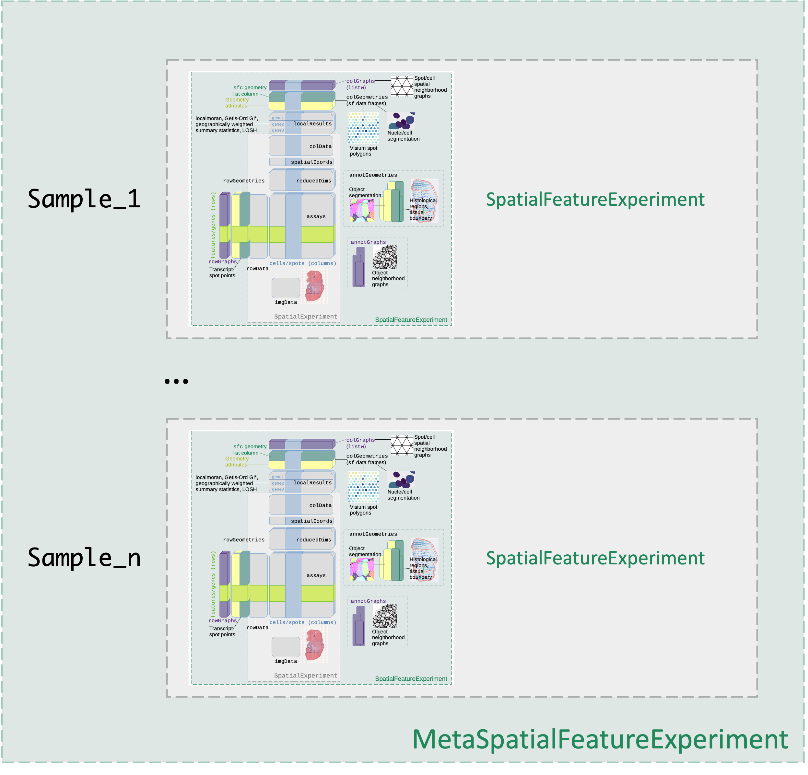

```{r, include = FALSE}
knitr::opts_chunk$set(
  collapse = TRUE,
  comment = "#>", 
  eval = TRUE
)
```

# Introduction

Welcome to the vignette of STExplorer. STExplorer is a package the performs geographically inspired analysis of spatial transcriptomics data.

This vignette is an introduction to STExplorer's interface as well as to the main geographical components used through the `SpatialFeatureExperiment` objects.

**STExplorer** comes with a set of vignettes to help you get the grips with and understand the methods. ALl vignettes are present in the `vignettes` folder on the GitHub repo. Below is a list of all available vignettes and their content:

```         
vignettes/
├── STExplorer_Analysis_FGWC.Rmd
│    Deep dive into FGWC analysis.
├── STExplorer_Analysis_GWPCA.Rmd
│    Deep dive into GWPCA analysis.
├── STExplorer_Analysis_GWR.Rmd
│    Deep dive into GWR analysis.
├── STExplorer_Analysis_SA.Rmd
│    Deep dive into SA statistics.
├── STExplorer_Analysis_commented.Rmd
│    The pipeline start-t-finish with comments.
├── STExplorer_Analysis_noComments.Rmd
│    The pipeline start-t-finish without comments (for those who want to jump into the code).
├── STExplorer_Structure.Rmd 
│    --> Start here. General introduction to STExplorer, structure and geometries.
└── STExplorer_and_Seurat.Rmd
     About working with Seurat and STExplorer (this vignette wil be updated soon)
```

## Install package

```{r eval=FALSE}
## To install the stable version of the package from Bioconductor run the below:
# if (!require("BiocManager", quietly = TRUE))
#     install.packages("BiocManager")
# 
# BiocManager::install("STExplorer")


## To install the development version of the package form GitHub run the below:
if (!require("devtools", quietly = TRUE))
    install.packages("devtools")

devtools::install_github("LefterisZ/STExplorer")


## To load the package use:
library(STExplorer)
```

```{r setup, echo=FALSE, eval=FALSE, message=FALSE}
# library(SpatialFeatureExperiment)
# library(tidyverse)
# library(scran)
# library(scater)
# library(ggspavis)
# library(sf)
# library(spdep)
# library(GWmodel)
# library(tidyterra)
# library(ggplot2)
# library(igraph)
# library(pheatmap)
# library(ggExtra)
# library(future)
# library(doFuture)
# library(foreach)
# library(progressr)
# library(parallel)
# library(cols4all)
# library(RColorBrewer)
```

The STExplorer package utilises methods from Geography's spatial data analysis techniques and packages to perform a spatially-aware and spatially-weighted analysis of spatial transcriptomics data. Below is a series of packages from the field of Geography that STExplorer depends on in one way or another. It is important to have a look in this vignette so that you can understand how STExplorer works.

-   [`spdep`](https://cran.r-project.org/web/packages/spdep/index.html) is a collection of functions to create spatial weights matrix objects from polygon *contiguities*, from point patterns by distance and tessellations. It is used for summarizing these objects, and for permitting their use in spatial data analysis like regional aggregation and tests for spatial *autocorrelation*.

-   [`sf`](https://cran.r-project.org/web/packages/sf/index.html) (*Simple Features for R*) is a package that offers support for simple features, a standardised way to encode spatial vector data. This allows for a versatile way to store and use geometries for spatial calculations and plotting.

-   [`GWmodel`](https://cran.r-project.org/web/packages/GWmodel/index.html) is a suite of models that fit situations when data are not described well by some global model, but where there are spatial regions where a suitably localised calibration provides a better description.

As with every other data analysis approach, data filtering and normalisation is a key step. For this reason STExplorer depends also in packages like [`scater`](https://bioconductor.org/packages/release/bioc/html/scater.html) and [`scran`](Spot-level%20quality%20control%20(sQC)%20procedures%20are%20employed%20to%20eliminate%20low-quality%20spots%20before%20conducting%20further%20analyses) to perform these steps. The choice of the packages was not random. The main reasoning is that we want STExplorer to operate within the Bioconductor environment. The `scater` and `scran` packages are within the Bioconductor environment and are two of the commonly used packages for spatial transcriptomics analysis which include a variety of options to normalise and pre-process data.

-   [`scater`](https://bioconductor.org/packages/release/bioc/html/scater.html) is also a Bioconductor package that is a selection of tools for doing various analyses of scRNA-seq gene expression data, with a focus on quality control and visualization which has extended applications to STx data too. It is based on the `SingleCellExperiment` and `SpatialExperiment` classes and thus is interoperable with many other Bioconductor packages such as [`scran`](Spot-level%20quality%20control%20(sQC)%20procedures%20are%20employed%20to%20eliminate%20low-quality%20spots%20before%20conducting%20further%20analyses), [`scuttle`](https://bioconductor.org/packages/release/scuttle) and [`iSEE`](https://bioconductor.org/packages/release/iSEE).

# Data structures

There is a long history of encapsulating expression data in S3 and S4 objects in R, going back to the `ExpressionSet` class in Biobase which was designed to store a matrix of microarray data alongside associated experimental metadata. This concept of storing all the relevant data and metadata in a single object has persisted through the development of RNA-Seq analysis (e.g. `SummarizedExperiment`) and into the age of single-cell transcriptomics (e.g. `SingleCellExperiment` - see below). Sticking with our choice of staying within Bioconductor, we are using an extension of the `SummarizedExperiment` object class which also incorporates features from the `sf` package.

## SpatialFeatureExperiment class

For the first part of this tutorial we will be introducing the [SpatialFeatureExperiment](https://bioconductor.org/packages/SpatialFeatureExperiment) a new S4 class built on top of the [SpatialExperiment](https://bioconductor.org/packages/SpatialExperiment) S4 class from Bioconductor as the main data structure for storing and manipulating datasets. The choice to use the `SpatialFeatureExperiment` instead of the `SpatialExperiment` was not random. The `SpatialFeatureExperiment` object class incorporates important features that allow biological spatial data (*bio-spatial data*) to be analysed and explored using geographical spatial data (*geo-spatial data*) analysis methods. To do this, the `SpatialFeatureExperiment` object incorporates geometries and geometry operations with the `sf` package (*more about the `sf` package in the next chapter*).

Let's have a quick look first at the internals of the `SpatialExperiment` object class. The `SpatialExperiment` is a specialized object class that supports the storing of spatially-resolved transcriptomics datasets within the Bioconductor framework. It builds on the [SingleCellExperiment](https://bioconductor.org/packages/SingleCellExperiment) class [@Amezquita2020Feb] for single-cell RNA sequencing data, which itself extends the `RangedSummarizedExperiment` class. More specifically, `SpatialExperiment` has extra customisations to store spatial information (i.e., spatial coordinates and images).

An overview of the `SpatialExperiment` object structure is is presented in \@ref(fig:SpExp-overview). In brief, the `SpatialExperiment` object consists of the below five parts:

1.  `assays`: gene expression counts\
2.  `rowData`: information about features, usually genes\
3.  `colData`: information on spots (non-spatial and spatial metadata)\
4.  `spatialCoords`: spatial coordinates\
5.  `imgData`: image data

**NOTE:** For spot-based STx data (i.e., 10x Genomics Visium), a single `assay` named `counts` is used.

```{r SpExp-overview, eval=TRUE, echo=FALSE, out.width = "100%", fig.align="center", fig.cap="Overview of the `SpatialExperiment` object class structure."}
knitr::include_graphics("images/SpatialExperiment.png")
```

For more details, see the related publication from Righelli et al., 2021 describing the `SpatialExperiment` [@Righelli2022Jun].

Now let's have a quick look at the extra features added to the `SpatialExperiment` to create the `SpatialFeatureExperiment`. An overview of the `SpatialFeatureExperiment` object structure is is presented in \@ref(fig:SpFeExp-overview). In brief, the `SpatialFeatureExperiment` object consists of the five `SpatialExperiment` parts plus the below extra ones:

1.  `colGraphs`: spatial neighbourhood graphs of cells or spots\
2.  `rowGraphs`: similar to `colGraphs` but for genes/features\
3.  `colGeometries`: `sf` data frames of entities corresponding to columns of the gene count matrix, such as Visium spots or cells\
4.  `rowGeometries`: similar to `colGeometries`, supporting entities corresponding to rows of the gene count matrix, such as genes\
5.  `annotGeometries`: `sf` data frames associated with the dataset but not directly with the gene count matrix, such as tissue boundaries\
6.  `annotGraphs`: similar to `colGraphs` and `rowGraphs`, but are for entities not directly associated with the gene count matrix, such as spatial neighbourhood graphs for nuclei\
7.  `localResults`: stores results from univariate and bivariate local spatial analysis results, such as from Moran's *I* spatial autocorrelation statistical test.

```{r SpFeExp-overview, echo=FALSE, out.width = "100%", fig.align="center", fig.cap="Overview of the `SpatialFeatureExperiment` (SFE) object class structure."}
knitr::include_graphics("images/SpatialFeatureExperiment.png")
```

For more details, see the related [vignette](https://bioconductor.org/packages/devel/bioc/vignettes/SpatialFeatureExperiment/inst/doc/SFE.html) from Moses and Pachter, 2023 describing the `SpatialFeatureExperiment` [@Moses2023SFE]. They have done an excellent job in both developing this package as well as documenting it.

## Geocomputational data structures

We have mentioned earlier that the `SpatialFeatureExperiment` class expands the `SpatialExperiment` class by adding geographical features mainly utilising a data structure commonly used in the geographical spatial data analysis named *Simple Features for R* or [sf](https://cran.r-project.org/web/packages/sf/index.html). For this reason we feel that it is good for us to quickly introduce to you the simple features data structure used in the the field of geography.

### Main geocomputational data structures

There are three main data structures that we need to have ready before we undertake a geocomputational approach to STx data analysis. Namely these are; (1) geometries (point and polygon), (2) neighbours lists and (3) distance matrices.

1.  Spatial geometries can be points, lines, polygons and pixels. Polygons consist of a multitude of points connected by lines and can have many forms like circle, hexagon, non-canonical polygon etc.

2.  Neighbour lists are special types of lists that contain information about the neighbours of each polygon. The neighbours can be defined either by adjacency or by distance.

3.  Distance matrices contain the distances between different points and can be either weighted or un-weighted. The weighted distances are usually objective to each point and its neighbours. Meaning that the closer or farther a neighbour is from the point of focus, the weight of their distance changes according to an applied kernel. Usually in the case of STx data, like the ones generated by the 10X Visium platform, the un-weighted distance between two points is expressed in pixels and we acquire it from the `spaceranger` output.

### The `sf` objects

Package `sf` represents simple features as native R objects. All functions and methods in `sf` that operate on spatial data are prefixed by *st\_*, which refers to *spatial type*. Simple features are implemented as R native data, using simple data structures (S3 classes, lists, matrix, vector). The typical use of `sf` involves reading, manipulating and writing of sets of features, with attributes and geometries.

As attributes are typically stored in `data.frame` objects (or the very similar `tbl_df`), we will also store feature geometries in a `data.frame` column. Since geometries are not single-valued, they are put in a list-column, a list of length equal to the number of records in the `data.frame`, with each list element holding the simple feature geometry of that feature. The three classes used to represent simple features are:

-   `sf`, the table (`data.frame`) with feature attributes and feature geometries, which contains
-   `sfc`, the list-column with the geometries for each feature (record), which is composed of
-   `sfg`, the feature geometry of an individual simple feature.

#### Simple feature geometry types

The following seven simple feature types are the most common:

| type                 | description                                                                                                                                                                                                               |
|-----------------------|------------------------------------------------|
| `POINT`              | zero-dimensional geometry containing a single point                                                                                                                                                                       |
| `LINESTRING`         | sequence of points connected by straight, non-self intersecting line pieces; one-dimensional geometry                                                                                                                     |
| `POLYGON`            | geometry with a positive area (two-dimensional); sequence of points form a closed, non-self intersecting ring; the first ring denotes the exterior ring, zero or more subsequent rings denote holes in this exterior ring |
| `MULTIPOINT`         | set of points; a MULTIPOINT is simple if no two Points in the MULTIPOINT are equal                                                                                                                                        |
| `MULTILINESTRING`    | set of linestrings                                                                                                                                                                                                        |
| `MULTIPOLYGON`       | set of polygons                                                                                                                                                                                                           |
| `GEOMETRYCOLLECTION` | set of geometries of any type except GEOMETRYCOLLECTION                                                                                                                                                                   |

: (#tab:table) Most common simple feature types.

Each of the geometry types can also be a (typed) empty set, containing zero coordinates (for `POINT` the standard is not clear how to represent the empty geometry). Empty geometries can be thought of as being the analogue to missing (`NA`) attributes, NULL values or empty lists.

#### sf: objects with simple features

As we usually do not work with geometries of single `simple features`, but with datasets consisting of sets of features with attributes, the two are put together in `sf` (simple feature) objects. The following command reads a test dataset called `nc` from a file that is contained in the `sf` package:

```{r 03_sf_LoadTest}
nc <- sf::st_read(system.file("shape/nc.shp", package = "sf"))
```

The short report printed gives the file name, the driver (ESRI Shapefile), mentions that there are 100 features (records, represented as rows) and 14 fields (attributes, represented as columns).

This object is of class:

```{r 03_sf_TestClass}
class(nc)
```

meaning it extends (and "is" a) `data.frame`, but with a single list-column with geometries, which is held in the column with name:

```{r 03_sf_Test_sf_column}
attr(nc, "sf_column")
```

If we print the first three features, we see their attribute values and an abridged version of the geometry

```{r 03_sf_Test_print, echo=TRUE, eval=FALSE}
print(nc[9:15], n = 3)
```

which would give the following output:

```{r Sf-overview, echo=FALSE, out.width = "100%", fig.align="center", fig.cap="Overview of the `sf` object."}
knitr::include_graphics("images/sf_xfig.png")
```

In the output we see:

-   in green a simple feature: a single record, or `data.frame` row, consisting of attributes and geometry
-   in blue a single simple feature geometry (an object of class `sfg`)
-   in red a simple feature list-column (an object of class `sfc`, which is a column in the `data.frame`)
-   that although geometries are native R objects, they are printed as [well-known text](#wkb)

It is also possible to create `data.frame` objects with geometry list-columns that are not of class `sf`, e.g. by:

```{r 03_sf_no.sf}
nc.no_sf <- as.data.frame(nc)
class(nc.no_sf)
```

However, such objects:

-   no longer register which column is the geometry list-column
-   no longer have a plot method, and
-   lack all of the other dedicated methods for class `sf`

**NOTE:** For the interested reader, a thorough explanation of the geographical features and the mechanics of the `sf` package can be found in the the very well written, well-descriptive and thorough `sf` package [vignette](https://cran.r-project.org/web/packages/sf/vignettes/sf1.html).

*The above section referring to the `sf` package was mainly are taken from there*

## MetaSpatialFeatureExperiment class

For the purpose of the analyses performed by STExplorer we decided to "expand" the SFE object but allow it to operate within the Bioconductor environment. The `MetaSpatialFeatureExperiment` object class or `MSFE`, is nothing more than a list of `SFE` objects. Despite the fact that an `SFE` object can encompass multiple samples (tissue slices), in an `MSFE` object, each `SFE` object contains only one sample. There are some opinionated reasons why we did this which we will explain later.

An overview of the `SpatialFeatureExperiment` object structure is presented in \@ref(fig:MSpFeExp-overview) below.

```{r MSpFeExp-overview, echo=FALSE, out.width = "100%", fig.align="center", fig.cap="Overview of the `MetaSpatialFeatureExperiment` (MSFE) object class structure."}

```

The `MSFE` class has getter (`getSFE`) and setter (`addSFE`) functions to extract and add `SFE` objects which include only one sample inside in case the user wants to work on an individual sample with another package.

```{r msfe_getSet}
## Load MSFE test data
load_visium_msfe("lung")

## Get a single sample as an SFE object
sfe <- getSFE(msfe_2, "Fibrotic")

## Add a single SFE object into the MSFE object
msfe_2 <- addSFE(msfe_2, sfe = sfe)
```

The `MSFE` class is also equipped with getter (`getMultiSFE`) and setter (`addMultiSFE`) functions to retrieve and add `SFE` objects that contain multiple samples inside in case the user wants to work on an individual `SFE` object containing multiple samples or wants to import such an object into the `MSFE` object.

```{r msfe_getSet-multi}
## Get a single SFE object containing multiple samples from within the MSFE object 
sfe_2samples <- getMultiSFE(msfe_2, c("Fibrotic", "Healthy"))

## Add an SFE object with multiple samples into the MSFE object as separate SFE objects with a single sample inside
msfe_2_new <- addMultiSFE(msfe_2, sfe_2samples)
```

## Inspect the MSFE and SFE objects

Below we will have a quick look at the internal structure of the MSFE and SFE objects.

### MSFE

As described in the previous chapter, the MSFE object is essentially a list of SFE objects that must contain only **ONE** sample.

```{r 01_data-inpect-msfe, message=FALSE}
## Have a look
str(msfe_2)
```

There is a number of reasons why we made that choice. As we mentioned earlier, this is an opinionated part of our approach to spatial transcriptomics data analysis. It is based primarily on the pre-processing steps of a spatial transcriptomics data analysis pipeline which we deem important for any subsequent analysis steps.

### SFE

Let's have a look at the structure of an `SFE` object from within the `MSFE` object.

```{r 01_data-inspect, message=FALSE}
## Check the object's structure
sfe

## Check number of features/genes (rows) and spots (columns)
dim(sfe)

## Check names of 'assay' tables
SummarizedExperiment::assayNames(sfe)
```

#### Counts table and gene metadata

```{r 01_counts-inspect, message=FALSE}
## Have a look at the counts table
assay(sfe)[1:6,1:4]
```

As we can see here the counts table is an object of class `dgTMatrix` which is a sparse matrix. This is because much like scRNA-seq data, STx data include many zeros. As a result, to make the counts table as light as possible we resort to using sparse matrices. This next code chunk examines a part of the matrix that includes genes with some level of expression:

```{r 01_counts-chunks, message=FALSE}
assay(sfe)[20:40, 2000:2010]

assay(sfe)[33488:33508, 2000:2010]
```

The levels of expression of different genes in the same spots differ significantly with many low values being present. We have to remember here that this data is not as yet normalised, and is therefore affected by systematic factors such as library size. Nonetheless, what is demonstrated here is typical for STx data (as it is for scRNA-seq data) - many genes will show low expression in individual spots.

To continue our exploration of the information stored in the `SpatialFeatureExperiment` object:

```{r 01_gene-metaData, message=FALSE}
## Have a look at the genes metadata
head(rowData(sfe))
```

#### Coordinates table and spot metadata

The data that distinguished a `SpatialExperiment` (and in extension a `SpatialFeatureExperiment`) object from the scRNA-seq equivalent is the coordinate data which describes the spatial location of each spot.

```{r 01_coordinates-inspect, message=FALSE}
## Check the spatial coordinates
head(spatialCoords(sfe))

## spot-level metadata
head(colData(sfe))

```

#### Image metadata

Finally, the `SpatialFeatureExperiment` object also contains the image data from the STx experiment, giving the coordinates we looked at in the previous section some context in terms of the tissue of origin.

```{r 01_image-inspect, message=FALSE}
## Have a look at the image metadata
imgData(sfe)
```

There is a chance that reloading an sfe object to the environment will lead to an error of "empty pointer". This is due to the way images are used inside the `SFE` object class.

Saving `SFE` objects as RDS files can be complex, especially with the `SpatRaster` images. These images must be wrapped using the `wrap` function in `terra` package before serialization to prevent invalid pointers upon reloading. Large images without a specified file source are stored temporarily and reloaded with the RDS file. Upon reading, images remain wrapped until necessary.

For this purpose, the `SpatialFeatureExperiment` package extends the `saveRDS` function. If you ever want to save an `SFE` class object use `SpatialFeatureExperiment::saveRDS` instead of any other method.

As well as this (fairly basic) metadata, the `sfe` object also contains the image itself, which the `SpatialFeatureExperiment` class allows us to access, like so:

```{r 01_plot-image, message=FALSE, fig.height=8, fig.width=8}
## retrieve the image
sfei <- imgRaster(getImg(sfe))
## "plot" the image
ggplot() + tidyterra::geom_spatraster_rgb(data = sfei, max_col_value = 65536)
```

We can also use the scaling factors in the `imgData` to plot the locations of the Visium spots over the image.

```{r 01_plot-spots, message=FALSE, fig.height=8, fig.width=8}
## "Plot" the image
p <- ggplot() + tidyterra::geom_spatraster_rgb(data = sfei, max_col_value = 65536)
p
## Extract the spot locations
spot_coords <- spatialCoords(sfe) %>% as.data.frame
## Add the spot points
p + geom_point(aes(x = spot_coords$pxl_col_in_fullres, y = spot_coords$pxl_row_in_fullres))
```

An equivalent plot, using `ggplot2` as the plotting library is implemented in the `STExplorer` package:

```{r 01_ggplot-spots, message=FALSE, fig.height=8, fig.width=8}
plotQC_tissueImg(sfe_2samples, res = "lowres", type = "spot")

```

Having to manually extract the relevant information from the `SpatialFeatureExperiment` object to generate plots does not generally make sense, and defies the point of using a data class that can encapsulate this information. We can instead use the in-built functions from `STExplorer` package which are explicitly built for generating visualisations of STx data directly from the `SpatialFeatureExperiment` object. We will make extensive use of these functions during the next chapter as we work through quality control processes for STx data. The pre-built nature of these plots is convenient and allows users to achieving tasks like adding the tissue image to the plot as well as modify the plot layout (since the functions return `ggplot` objects).

#### Column geometries

```{r}
colGeometries(sfe)

colGeometry(sfe)
```

#### Column graphs

```{r}
colGraphs(sfe)

colGraph(sfe)

```

# STExplorer Analysis pipeline

So far we had an introduction to the data structures used in the `STExplorer` analysis pipeline. In the `STExplorer_Analysis_commented.Rmd` vignette we will guide you step by step through the analysis of spatial transcriptomics data using the `STExplorer` package.

# References {.unnumbered}

Here is the output of `sessionInfo()` on the system on which this document was compiled

```{r echo=FALSE}
sessionInfo()
```
